# Documento de análisis de requisitos del sistema
**Asignatura:** Diseño y Pruebas (Grado en Ingeniería del Software, Universidad de Sevilla)  
**Curso académico:** 2025/2026
**Grupo/Equipo:** L5-3 
**Nombre del proyecto:** End Of Line
**Repositorio:** [https://github.com/gii-is-DP1/dp1-2025-2026-l5-3-25.git] (http://github.com)
**Integrantes (máx. 6):** 
- **Álvaro de Pablos Sánchez** (wbk2747 / alvpapbsan@alum.us.es)  
- **Carmen Camacho Montes** (JBV8381 / carcammon@alum.us.es)  
- **Francisco Casasola Calzadilla** (QHR9543 / fracascal@alum.us.es)  
- **Alejandro Pichardo Martínez** (alepicmar / alepicmar@alum.us.es)  
- **Juan Pozo Gracia** (DKK2084 / juapozgar@alum.us.es)  
- **Nicolás Pérez Martín** (YGC9995 / nicpermar@alum.us.es)  

## Introducción

En este proyecto vamos a implementar el juego **End Of Line** de manera online, de manera que se facilite la jugabilidad entre jugadores sin material físico, garantizando la aplicación de las reglas de manera justa y automática.

El juego está diseñado principalmente para **2 jugadores** en su modo clásico (*versus*), aunque cuenta también con variantes que amplían la experiencia, con la posibilidad de jugar hasta **8 jugadores**:

- **Modo solitario/puzzle**: pensado para un solo jugador.  
- **Modo battle royale**: admite 3 o más jugadores de forma competitiva.  
- **Modo cooperativo/equipos**: los jugadores colaboran en equipos contra otros.  

**End of Line** es un juego de cartas para 2 o más jugadores, con una duración de entre **15 y 30 minutos** según el modo y cantidad de jugadores.  
Su objetivo principal es extender tu línea de cartas en el tablero, cortando la línea de tu oponente antes de que corte la tuya.

### Preparación del juego
- Se selecciona el modo de juego, proporcionando el tablero correspondiente según el número de jugadores
   1.  5x5 para 1 jugador
   2.  7x7 para 2-3 jugadores
   3.  9x9 para 4-5 jugadores
   4.  11x11 para 6-7 jugadores
   5.  13x13 para 8 jugadores
- Cada jugador recibe una carta de inicio, una carta de energía y un mazo de 25 cartas de línea.  

### Desarrollo de la partida
La partida se desarrolla por turnos, al comenzar la partida cada jugador obtiene 5 cartas de su mazo, si no está conforme puede barajarlas y obtener otras 5, se saca una carta fuera del tablero y el jugador con la iniciativa (número indicado en la esquina superior derecha de nuestra carta de línea) más baja empieza. Cada ronda tiene 3 fases: la primera se colocan las cartas de línea en el tablero, la segunda se roba el número de cartas de nuestro mazo para tener siempre 5 en nuestra mano y por último, se vuelven a comprar las iniciativas para saber el jugador que comienza la siguiente ronda. En la primera ronda solo usamos una carta sobre el tablero, a partir de la segunda usamos 2 y desde la tercera ronda, se habilitan los puntos de energía, proporcionando habilidades especiales.

Cada jugador dispone de 3 puntos de energía, y solo se podrá consumir 1 punto por ronda , a partir de la 3ª ronda. Las diferentes habilidades especiales son:
 - Acelerón: puedes usar una carta de línea más.
 - Frenazo: puedes usar solo una carta de línea.
 - Marcha atrás: puedes usar la salida de la penúltima carta echada en la ronda anterior
 - Gas extra: puedes robar una carta de línea adicional
 - Salto de línea (Solo disponible en el modo de juego Team Battle): puedes saltar la línea de tu compañero para poder continuar la tuya 

### Fin de la partida
La partida termina cuando un jugador queda **bloqueado**, de manera que no pueda realizar ningún movimiento.  
Cuando esto ocurre, se determina la victoria según el modo de juego:

- **Modo versus**: gana el jugador que haya bloqueado al oponente.  
- **Puzzle solitario**: consiste en cubrir la totalidad del área de juego 5x5 usando tu mazo sin cortar tu línea, la puntuación final será la suma de las iniciativas de tus cartas sobrantes y los puntos de energía restantes. (Hay diferentes puzzles para completar) 
- **Solitario Clásico**: tiene el mismo objetivo que el modo Puzzle Solitario, pero no hay fase de robo, empiezas sin cartas en la mano y vas robando las cartas de una en una, pudiendo usarlas y descartarlas boca arriba en una pila de descarte. Por lo que antes de robar podrás usar la primera carta de la pila
- **Puzzle Cooperativo**: tiene el mismo objetivo que el Puzzle Solitario, pero en este participan 2 o más jugadores
- **Battle Royale**: igual que el modo versus, pero con más de 2 jugadores hasta 8 como máximo
- **Team Battle**: este modo tiene las mismas reglas que el modo Versus, pero los jugadores jugarán en equipos y podrán usar el tipo de energía Salto de Línea, exclusivo para este modo. No se puede continuar la línea de tu compañero
  

[https://www.youtube.com/watch?v=5t18m8ePuo0] (http://youtube.com)

## Tipos de Usuarios / Roles

**Jugador:** Usuario del juego el cuál puede crear partidas, crear y eliminar su cuenta, iniciar y
cerrar sesión, editar su perfil, añadir, invitar y eliminar amigos, y jugar y espectar partidas del juego.

**Administrador:** Usuario encargado de supervisar y controlar el funcionamiento de la
aplicación, asegurando su eficiencia y seguridad. Este usuario tiene privilegios y
responsabilidades especiales y su rol implica tomar decisiones clave y garantizar el adecuado rendimiento del sistema.

## Historias de Usuario

A continuación se definen  todas las historias de usuario a implementar:

## 1 GESTIÓN DE USUARIOS 

### HU-01 – Creación de cuenta de usuario
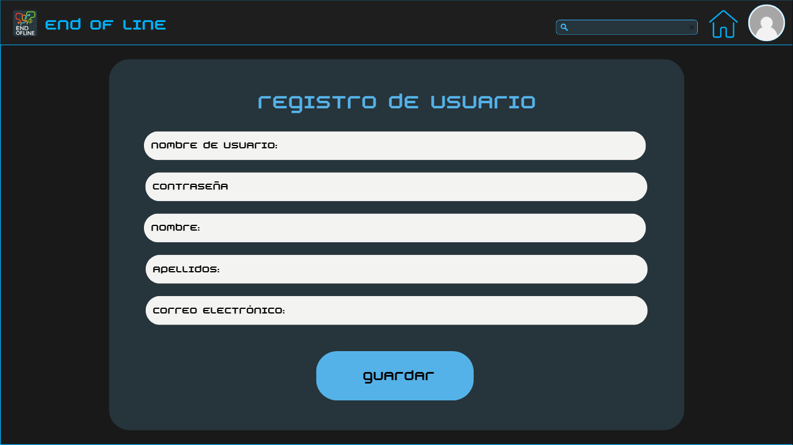

**Como** jugador  
**quiero** crear un nuevo usuario  
**para** poder comenzar a jugar bajo un nombre reconocible para el resto de los jugadores.  

#### Descripción detallada  
Al pulsar el botón **“Crear cuenta”** en la pantalla inicial, el sistema mostrará un formulario con los campos de **nombre y apellidos**, **nombre de usuario**, **correo electrónico** y **contraseña**. Una vez completado, el sistema validará la información y guardará el nuevo usuario en la base de datos.  

#### Restricciones  
- El nombre de usuario debe ser **único** y contener **entre 3 y 20 caracteres alfanuméricos**.  
- La contraseña debe tener **entre 8 y 15 caracteres**, incluyendo **mayúsculas, minúsculas, al menos un número y un carácter especial**.  
- El correo debe tener **formato válido de email**.  

#### Escenarios  

**Positivo:**  
- El usuario introduce datos válidos y el sistema crea correctamente la cuenta.  

**Negativo:**  
- Si se introducen datos inválidos (usuario ya registrado, usuario fuera de rango, contraseña inválida o correo incorrecto), el sistema mostrará un error y no permitirá guardar.  

---

### HU-02 – Eliminación de cuenta
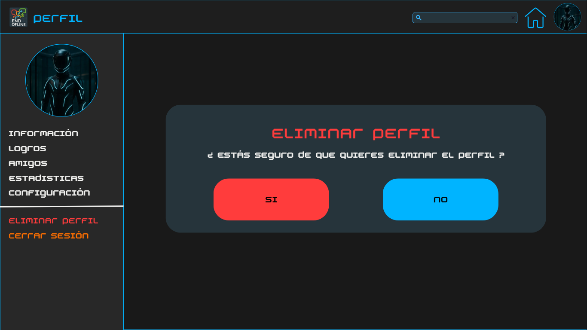
**Como** administrador  
**quiero** que el sistema me permita eliminar mi cuenta  
**para** que mis datos dejen de estar en la base de datos del sistema.  

#### Descripción detallada  
Desde el panel de usuario, al seleccionar la opción **“Eliminar cuenta”**, el sistema mostrará un mensaje de confirmación. Si el usuario confirma, el sistema eliminará completamente su información de la base de datos.  

#### Restricciones  
- El usuario debe estar **logueado** para poder eliminar su cuenta.  
- Una vez eliminada, **no se podrá recuperar** la información.  

#### Escenarios  

**Positivo:**  
- El usuario logueado confirma la acción y el sistema elimina correctamente la cuenta.  

**Negativo:**  
- Si el usuario no está logueado, la opción de eliminar cuenta no se mostrará.  

---

### HU-03 – Inicio de sesión
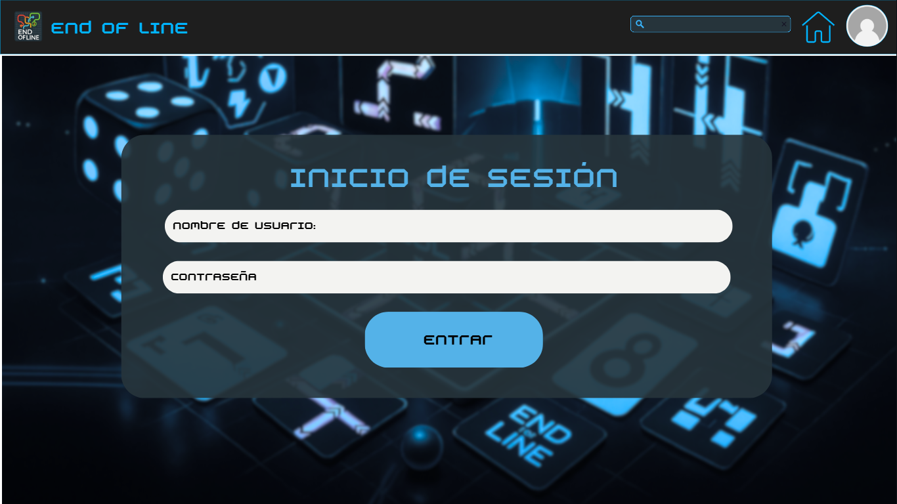
**Como** jugador o administrador  
**quiero** iniciar sesión con mis credenciales  
**para** poder acceder al sistema.  

#### Descripción detallada  
En la pantalla de inicio de sesión, el usuario debe introducir **nombre de usuario**, **correo electrónico** y **contraseña**. El sistema validará los datos y permitirá el acceso si son correctos.  

#### Restricciones  
- El nombre de usuario debe estar **registrado**.  
- La contraseña debe **coincidir** con la registrada para ese usuario.  
- El correo debe estar **asociado** al usuario.  

#### Escenarios  

**Positivo:**  
- El usuario introduce credenciales correctas y accede al sistema.  

**Negativo:**  
- Si se introducen datos inválidos (usuario no existe, contraseña incorrecta o correo no asociado), el sistema muestra un error y no permite acceder.  

---

### HU-04 – Cierre de sesión
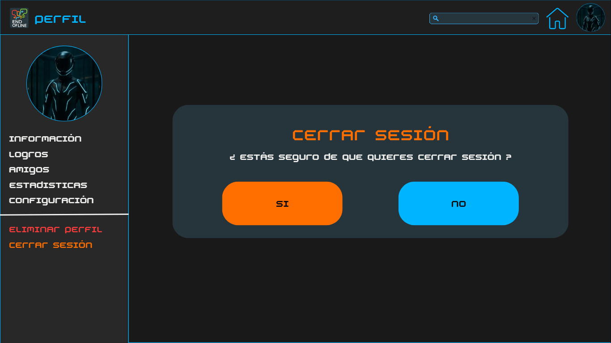
**Como** jugador o administrador  
**quiero** poder cerrar sesión  
**para** finalizar mi acceso o cambiar de cuenta.  

#### Descripción detallada  
Desde el menú del usuario logueado, al pulsar **“Cerrar sesión”**, el sistema finalizará la sesión activa y volverá a la pantalla inicial.  

#### Restricciones  
- El usuario debe estar **logueado** para cerrar sesión.  
- No se permite cerrar sesión **mientras el usuario esté jugando una partida**.  

#### Escenarios  

**Positivo:**  
- El usuario logueado cierra sesión correctamente.  

**Negativo:**  
- Si el usuario no está logueado o está en medio de una partida, el sistema muestra un error y no permite cerrar sesión.  

---

### HU-05 – Edición de cuenta existente
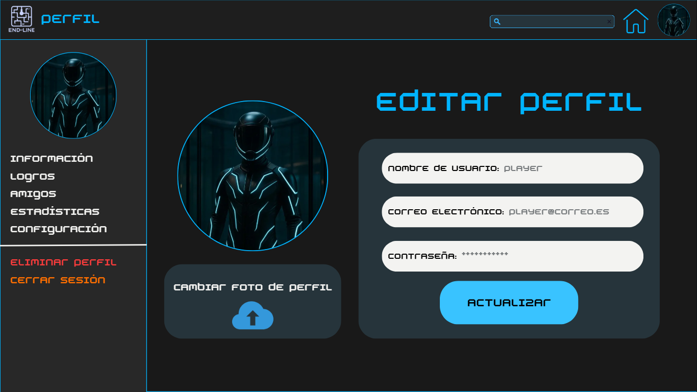
**Como** jugador o administrador  
**quiero** poder editar mi cuenta  
**para** actualizar mis credenciales (nombre, correo y contraseña).  

#### Descripción detallada  
Desde el perfil de usuario, se podrá acceder a un formulario para editar **nombre de usuario**, **correo** y **contraseña**. El sistema validará los cambios antes de guardarlos en la base de datos.  

#### Restricciones  
- El nuevo nombre de usuario debe ser **único** y cumplir con el formato válido (3–20 caracteres alfanuméricos).  
- La nueva contraseña debe ser **distinta** de la anterior y cumplir las reglas de seguridad (8–15 caracteres, mayúsculas, minúsculas, número y carácter especial).  
- El correo debe ser **único** y con formato válido de email.  
- Es obligatorio introducir la **contraseña anterior** para poder cambiar la contraseña.  

#### Escenarios  

**Positivo:**  
- El usuario introduce datos válidos y el sistema actualiza la cuenta correctamente.  

**Negativo:**  
- Si se introducen datos inválidos (usuario ya registrado, contraseña idéntica o incorrecta, correo no válido), el sistema muestra un error y no permite guardar.  

---

### HU-06 – Crear usuario administrador
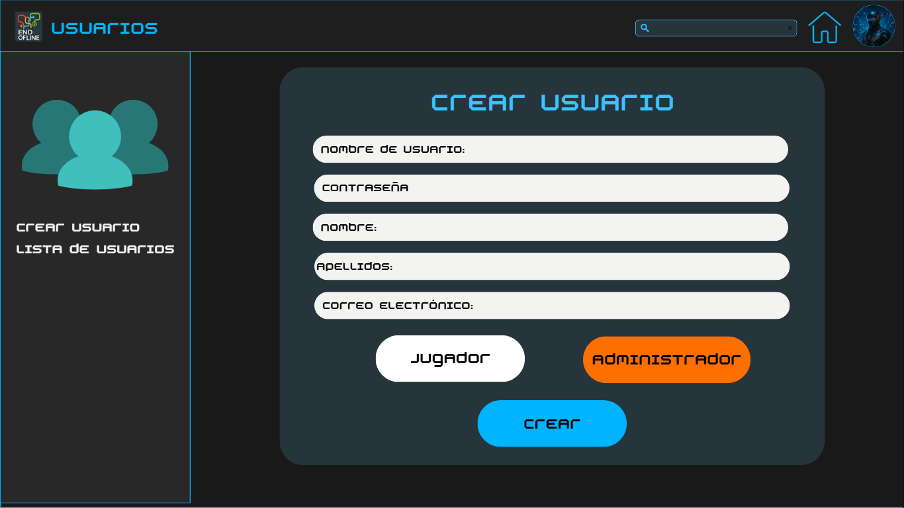
**Como** administrador  
**quiero** poder crear nuevos usuarios asignándoles un rol  
**para** que puedan acceder al sistema con los permisos correspondientes.  

#### Descripción detallada  
Al pulsar el botón **“Crear Usuario”** en la sección de usuarios, el sistema mostrará un formulario con campos como **nombre**, **apellidos**, **nombre de usuario**, **correo electrónico**, **contraseña** y **rol** (jugador, administrador). Una vez completado, el sistema validará la información y guardará el nuevo usuario en la base de datos.  

#### Restricciones  
- El administrador debe estar **autenticado**.  
- El correo electrónico debe ser **único** y con formato válido.  
- La contraseña debe cumplir **criterios mínimos de seguridad** (ej. 8 caracteres, alfanumérica).  

#### Escenarios  

**Positivo:**  
- El administrador introduce datos válidos y el sistema crea correctamente al nuevo usuario.  

**Negativo:**  
- Si los campos obligatorios están vacíos o no cumplen las reglas de validación, el sistema mostrará un error y no permitirá guardar.  

---

### HU-07 – Editar usuario administrador
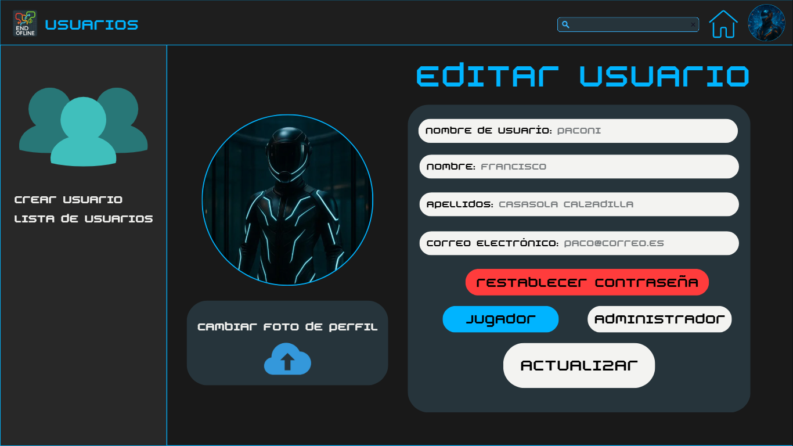
**Como** administrador  
**quiero** poder editar los datos de un usuario existente, incluido su rol  
**para** mantener la información actualizada y gestionar permisos en el sistema.  

#### Descripción detallada  
Al pulsar el botón **“Editar Usuario”** desde el listado, el sistema mostrará un formulario precargado con los datos actuales. El administrador podrá modificar **nombre**, **apellidos**, **nombre de usuario**, **correo electrónico**, **rol** o **restablecer la contraseña**. Una vez confirmada la acción, el sistema actualizará los datos en la base de datos.  

#### Restricciones  
- El administrador debe estar **autenticado**.  
- No se permiten **correos duplicados** ni **contraseñas vacías**.  
- El rol debe seleccionarse de la **lista predefinida** de roles disponibles.  

#### Escenarios  

**Positivo:**  
- El administrador introduce datos válidos y el sistema actualiza correctamente la información.  

**Negativo:**  
- Si se introducen datos inválidos (correo duplicado, campos vacíos), el sistema mostrará un mensaje de error y no guardará los cambios.  

---

### HU-08 – Eliminar usuario administrador
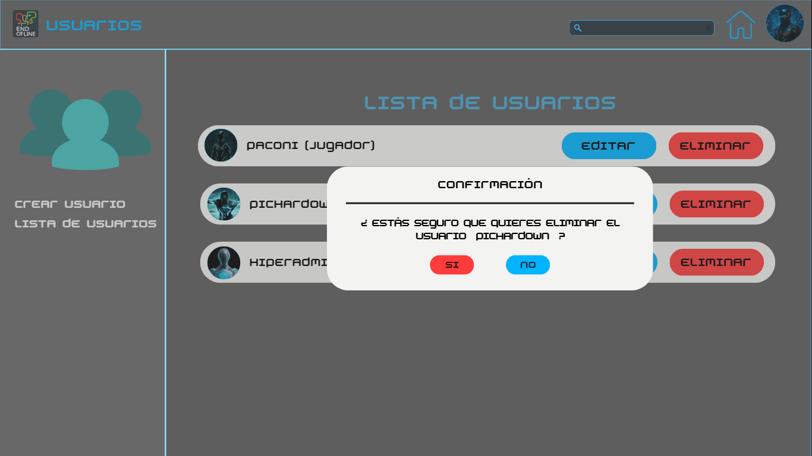
**Como** administrador  
**quiero** poder eliminar un usuario del sistema  
**para** revocar su acceso y participación en el juego.  

#### Descripción detallada  
Al pulsar el botón **“Eliminar Usuario”**, el sistema mostrará un modal de confirmación. Si el administrador confirma, el usuario se elimina de la base de datos y ya no podrá acceder al sistema.  

#### Restricciones  
- El administrador debe estar **autenticado**.  
- No se permite eliminar al **usuario administrador principal**.  

#### Escenarios  

**Positivo:**  
- El administrador confirma la acción y el sistema elimina correctamente al usuario.  

**Negativo:**  
- Si se cancela la confirmación, no se realiza ningún cambio.  

---

### HU-09 – Ver detalle de usuario administrador
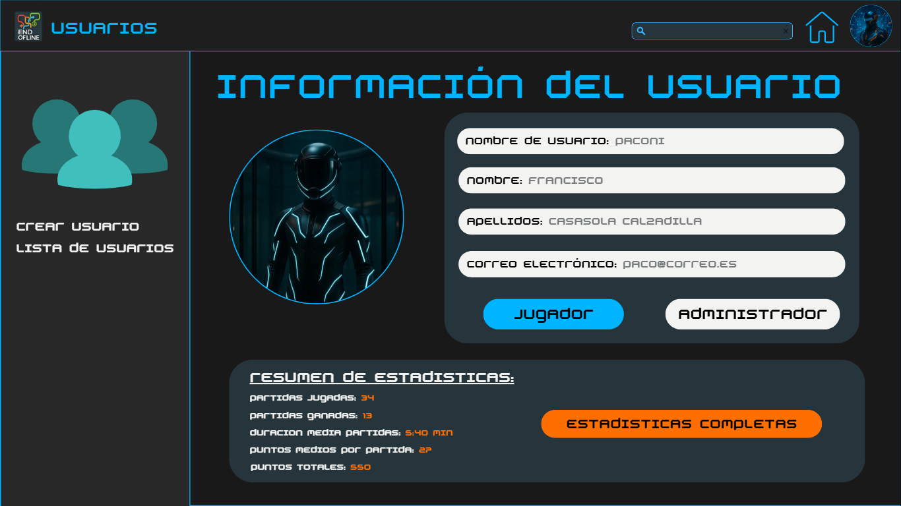
**Como** administrador  
**quiero** poder seleccionar un usuario del listado y ver toda su información en detalle  
**para** consultar sus datos personales, rol y estadísticas sin necesidad de editarlos.  

#### Descripción detallada  
Desde el listado de usuarios, al seleccionar un usuario, el sistema mostrará un **panel o desplegable** con la información completa del usuario.  

#### Restricciones  
- El administrador debe estar **autenticado**.  
- La vista de detalle debe ser de **solo lectura** (no editable).  
- Los datos deben cargarse en **tiempo real** desde la base de datos.  
- Si el usuario no existe (fue eliminado mientras se accedía), se debe mostrar un **mensaje de error**.  

#### Escenarios  

**Positivo:**  
- El administrador selecciona un usuario existente y se abre el panel con toda la información detallada.  
- El sistema muestra correctamente todos los campos (excepto la contraseña).  

**Negativo:**  
- Si el usuario no existe (ej. fue eliminado), el sistema muestra un mensaje de que no está disponible.  
- Si ocurre un error en la base de datos, se muestra un mensaje de fallo al cargar los datos.  

---

### HU-10 – Listar usuarios registrados
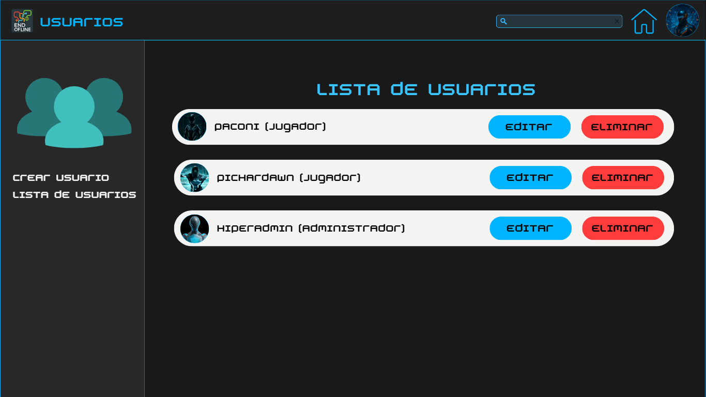
**Como** administrador  
**quiero** visualizar un listado de todos los usuarios registrados  
**para** gestionarlos fácilmente desde un panel centralizado.  

#### Descripción detallada  
El sistema mostrará una **tabla** con los usuarios registrados en la aplicación, incluyendo campos como **ID**, **nombre**, **correo**, **rol** y **fecha de creación**. Desde este listado se podrá acceder directamente a las acciones de **crear**, **editar** y **eliminar usuarios**.  

#### Restricciones  
- El administrador debe estar **autenticado**.  
- La tabla debe mostrar **paginación o scroll** si hay un número elevado de usuarios.  

#### Escenarios  

**Positivo:**  
- El administrador accede a la sección y ve correctamente la lista de usuarios con la información actualizada.  
- El administrador accede a la sección y se ve un array vacío con un mensaje informativo de que aún no hay usuarios registrados.  

**Negativo:**  
- Si ocurre un error en la base de datos, se muestra un mensaje de fallo al cargar los datos.  

## 2 JUEGO

### HU-11 – Creación de partida

**Como** jugador  
**quiero** crear una nueva partida en línea  
**para** invitar a otros jugadores y comenzar una sesión de juego.

#### Descripción detallada
El sistema debe permitir al usuario crear una sala indicando:
- **Nombre de la partida**  
- **Modo de juego** (Versus, Battle Royale, Puzle Solitario, Solitario Clásico, Puzzle Cooperativo, Team Battle)  
- **Número de jugadores** (mínimo 1, máximo 8)  

Una vez configurada, la sala quedará disponible para que otros jugadores puedan unirse antes de iniciar la partida.

#### Restricciones
- El usuario debe estar **logueado**.  
- La **elección del modo de juego** es obligatoria.  
- El **número de jugadores** debe estar dentro del rango permitido (1–8).

#### Escenarios

**Positivo:**  
- El jugador introduce datos válidos (nombre, modo, número de jugadores) y el sistema crea la sala correctamente.

**Negativo:**  
- Si se introducen datos inválidos (no elegir modo, número de jugadores fuera del rango, usuario no logueado), el sistema muestra un error y no permite crear la partida.

---

### HU-12 – Jugar partida en modo Versus
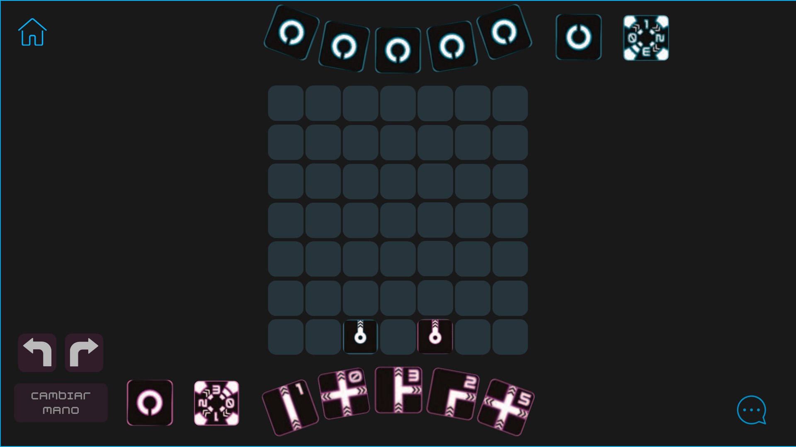
**Como** jugador  
**quiero** jugar en modo Versus  
**para** competir contra otro jugador y tratar de cortar su línea antes de que corte la mía.

#### Descripción detallada
El sistema crea un área de juego de **7x7** cartas. Cada jugador coloca cartas de línea continuando su recorrido desde su carta de inicio. El turno se determina por la **Iniciativa** y los jugadores alternan jugadas. La partida termina cuando un jugador **no puede continuar su línea**.

#### Restricciones
- Solo participan **2 jugadores**.  
- El área está limitada a **7x7** cartas.  
- Se deben respetar las **reglas de colocación** (entradas/salidas válidas).

#### Escenarios

**Positivo:**  
- Ambos jugadores colocan cartas válidas y el juego progresa hasta que uno corta la línea del otro → se declara un ganador.

**Negativo:**  
- Si se intenta colocar una carta fuera de la cuadrícula o sin seguir la dirección de la línea, el sistema muestra un error y no permite la jugada.

---

### HU-13 – Jugar partida en modo Battle Royale 

**Como** jugador  
**quiero** jugar en modo Battle Royale  
**para** competir con varios jugadores a la vez y ser el último en mantener mi línea.

#### Descripción detallada
El sistema crea un área cuyo tamaño depende del número de jugadores:  
- **7x7** para 3  
- **9x9** para 4–5  
- **11x11** para 6–7  
- **13x13** para 8  

Cada jugador coloca cartas siguiendo las mismas reglas que en Versus. Gana el **último jugador** cuya línea permanezca activa.

#### Restricciones
- De **3 a 8** jugadores.  
- Se aplica la misma mecánica de **iniciativa** y **colocación** que en Versus.  
- El **área varía** según el número de jugadores.

#### Escenarios

**Positivo:**  
- Los jugadores siguen colocando cartas y el sistema determina al último jugador con línea → **ganador**.

**Negativo:**  
- Si se rompe la regla de colocación o se exceden los límites de la cuadrícula, el sistema marca error y no acepta la jugada.

---

### HU-14 – Jugar partida en modo Puzzle Solitario
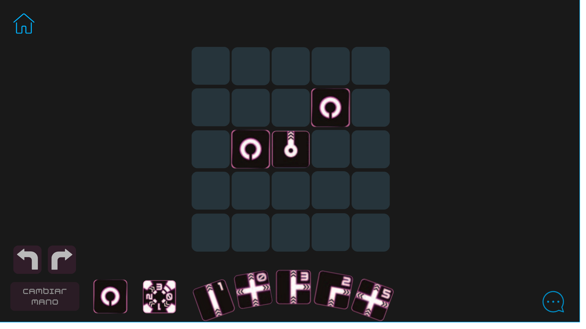
**Como** jugador  
**quiero** jugar en modo Puzzle Solitario  
**para** completar un tablero de 5x5 y medir mi puntuación según cartas sobrantes y energía no usada.

#### Descripción detallada
El jugador debe cubrir completamente un área de **5x5** colocando cartas de línea válidas. La **puntuación final** se calcula sumando la **iniciativa** de las cartas sobrantes + los **puntos de energía** no consumidos.

#### Restricciones
- Solo **1 jugador**.  
- Área de juego fija **5x5**.  
- Se aplican las **reglas de colocación** de cartas de línea.

#### Escenarios

**Positivo:**  
- El jugador completa el **5x5** y se calcula su puntuación correctamente.

**Negativo:**  
- Si coloca cartas inválidas o no puede completar el área, el sistema muestra error o finaliza la partida con **puntuación reducida**.

---

### HU-15 – Jugar partida en modo Solitario Clásico
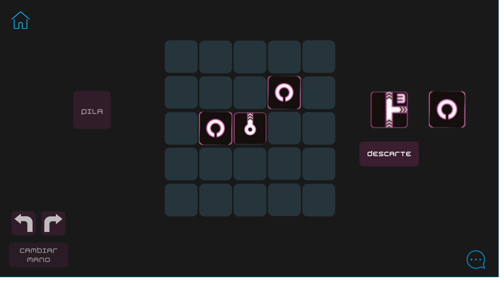
**Como** jugador  
**quiero** jugar en modo Solitario Clásico  
**para** cubrir el área de 5x5 robando cartas una a una y decidiendo entre colocarlas o descartarlas.

#### Descripción detallada
El jugador empieza **sin cartas en mano**, roba del mazo **una a una** y decide **colocarla** o **descartarla**. Puede **recuperar la carta superior** de la pila de descartes. La puntuación se calcula igual que en **Puzzle Solitario**.

#### Restricciones
- Solo **1 jugador**.  
- Área fija **5x5**.  
- No existe fase de robo múltiple: **siempre** se juega **de una en una**.

#### Escenarios

**Positivo:**  
- El jugador completa el **5x5** siguiendo las reglas y obtiene **puntuación válida**.

**Negativo:**  
- Si no puede colocar cartas siguiendo la línea o descarta en exceso, el sistema finaliza la partida y calcula **puntuación baja**.

---

### HU-16 – Jugar partida en modo Puzzle Cooperativo

**(ESTA HISTORIA NO HA SIDO IMPLEMENTADA DEBIDO AL PARENTESCO CON EL MODO DE JUEGO PUZZLE SOLITARIO, NOS INDICARON NO IMPLEMENTARLA EN MITAD DEL DESARROLLO DE NUESTRO PROYECTO)**

**Como** jugador  
**quiero** jugar en modo Puzzle Cooperativo  
**para** coordinarme con otros jugadores y completar un área de juego conjunta.

#### Descripción detallada
Los jugadores **colaboran** para cubrir por completo un área de juego (tamaño según jugadores). Se aplican las reglas de colocación del **Puzzle Solitario**, pero entre varios jugadores. La **puntuación** se calcula igual que en Puzzle Solitario.

#### Restricciones
- **2 o más** jugadores.  
- Área de **5x5** hasta **13x13** según jugadores.  
- Decisiones **coordinadas** respetando las reglas.

#### Escenarios

**Positivo:**  
- El grupo completa el área respetando reglas y se calcula la **puntuación global**.

**Negativo:**  
- Si un jugador coloca una carta inválida o rompe la línea, el sistema lo rechaza y no permite continuar hasta **corregir**.

---

### HU-17 – Jugar partida en modo Team Battle
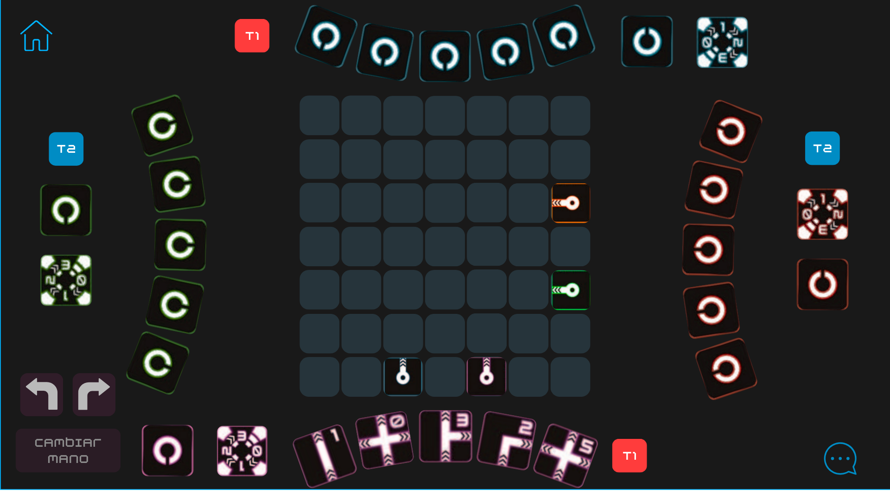
**Como** jugador  
**quiero** jugar en modo Team Battle  
**para** competir en equipos manteniendo mi línea y apoyando a mis compañeros.

#### Descripción detallada
Los jugadores se dividen en **equipos**. Cada jugador juega con reglas de Versus/Battle Royale, pero puede **saltar una carta** de la línea de su compañero **gastando 1 punto de energía**. Gana el equipo que deja al rival **sin líneas válidas**.

#### Restricciones
- **2 o más** jugadores en equipos.  
- El **salto de línea** solo se permite en **1 carta** del compañero.  
- No se puede **continuar** directamente la línea del compañero.

#### Escenarios

**Positivo:**  
- El equipo coordina jugadas y elimina a los rivales → **gana** la partida.

**Negativo:**  
- Si un jugador intenta continuar la línea de un compañero o saltar más de 1 carta, el sistema **muestra error** y no valida la jugada.

---

### HU-18 – Visualizar partidas creadas y jugadas
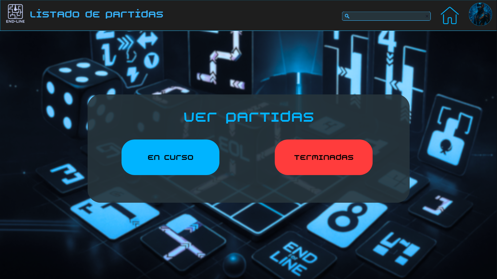
**Como** jugador  
**quiero** visualizar un listado de partidas creadas y en las que participé  
**para** consultar mi historial y acceder a la información.

#### Descripción detallada
El sistema mostrará para cada partida:
- **ID de partida**  
- **Nombre / código de sala**  
- **Estado** (en curso / finalizada)  
- **Modo de juego**  
- **Fecha** de creación/participación  
- **Resultados** (si está finalizada)

#### Restricciones
- Solo partidas en las que el jugador haya **participado o creado**.  
- Si no existen partidas, se mostrará mensaje: **“No tienes partidas registradas aún…”**.

#### Escenarios

**Positivo:**  
- El jugador ve correctamente el listado con sus partidas creadas y jugadas.

**Negativo:**  
- Si no hay partidas o hay error de carga, se muestra mensaje informativo o de **fallo**.

---

### HU-19 – Visualizar partidas en curso
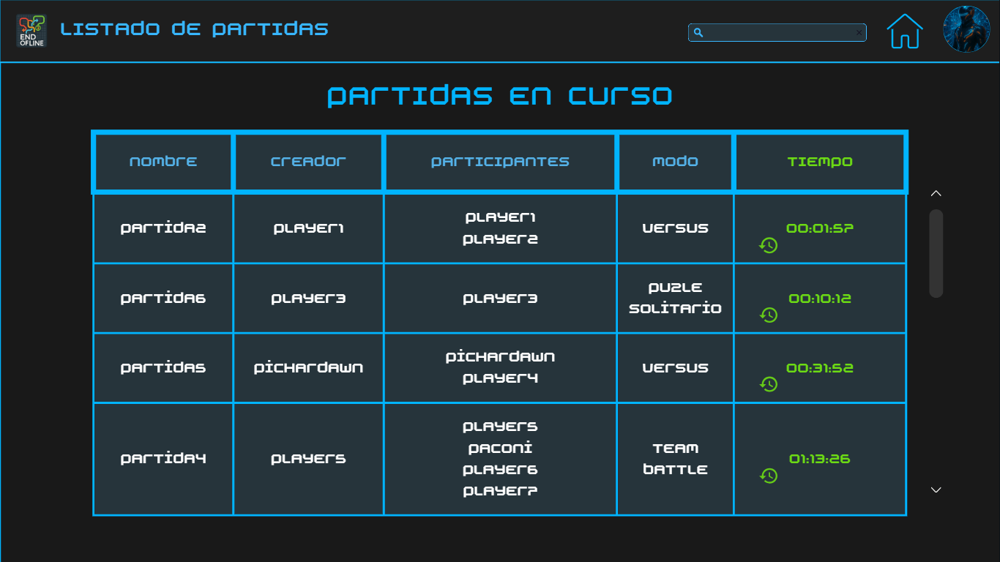
**Como** administrador  
**quiero** ver todas las partidas en curso  
**para** llevar un seguimiento en tiempo real del desarrollo.

#### Descripción detallada
Listado de partidas activas con:
- **Nombre/código de sala**  
- **Creador**  
- **Participantes**  
- **Modo de juego**  
- **Tiempo transcurrido**

#### Restricciones
- El administrador debe estar **autenticado**.  
- Vista **solo lectura** (no modifica la partida).

#### Escenarios

**Positivo:**  
- Ve correctamente la lista de partidas en curso con información actualizada.

**Negativo:**  
- Si no existen partidas en curso, mensaje: **“No hay partidas activas en este momento”**.

---

### HU-20 – Visualizar partidas terminadas
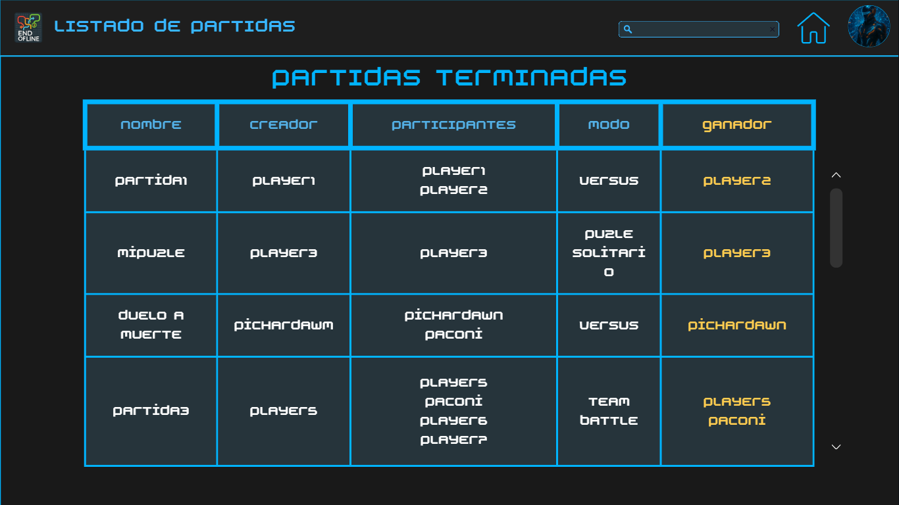
**Como** administrador  
**quiero** ver todas las partidas finalizadas con resultados  
**para** llevar un registro histórico.

#### Descripción detallada
Listado con:
- **Nombre**  
- **Creador**  
- **Ganador**  
- **Participantes**  
- **Modo**  
- **Duración**

#### Restricciones
- Administrador **autenticado**.  
- Información **histórica**: no editable.

#### Escenarios

**Positivo:**  
- Accede al historial y ve correctamente la lista con información detallada.

**Negativo:**  
- Si no existen partidas finalizadas, mensaje: **“No hay partidas registradas”**.

---

### HU-21 – Unión a una partida
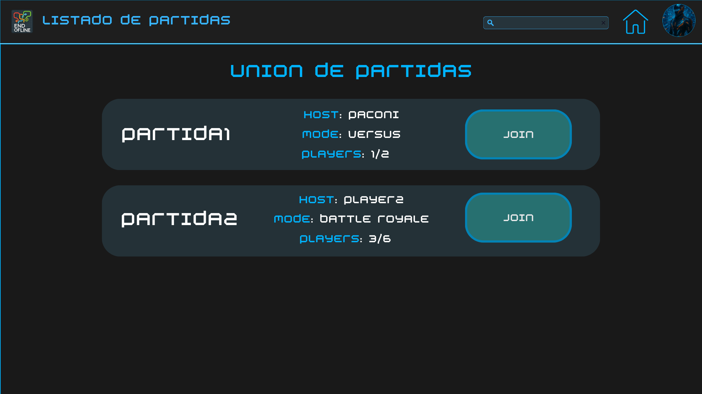
**Como** jugador  
**quiero** ver todas las partidas accesibles   
**para** poder jugar una partida que seleccione.

#### Descripción detallada
Se mostrará el listados de partidas pendientes, ya sean públicas y privadas. En el caso de ser pública tendremos un botón que nos redirigirá al lobby de esa por tanto. Sin embargo si la partida es privada al pulsar en ese botón, posteriormente tendremos que aplicar el código de acceso a esa partida.

#### Restricciones
- Jugador **autenticado**.  
- Estado de la partida pendiente
- Partida con jugadores incompletos

#### Escenarios

**Positivo:**  
- Presiona el boton de unión, si es privada introduce el código de acceso, y entra en el lobby del juego.

**Negativo:**  
- Si no existen partidas pendientes, mensaje: **“No pending games at this moment”**.
- Si introduce mal el código de acceso, no permitirá unirse.
- Si la partida aún sigue en el lobby , pero está completa en jugadores, no permitirá unirse.
---

### HU-22 – Invitación a amigos a la partida

**Como** jugador  
**quiero** poder invitar a mis amigos a la partida   
**para** poder jugar una partida con ellos.

#### Descripción detallada
En el lobby habrá un botón para invitar a nuestros amigos, donde al pulsarlo nos mostrará la lista de amigos para poder manda una inivtación a nuestra partida mediante otro botón.

#### Restricciones
- Jugador **autenticado**.  
- Estado de la partida pendiente
- Partida con jugadores incompletos

#### Escenarios

**Positivo:**  
- Presiona el boton de invitación a tu amigo, mensaje: **"Solicitud enviada"**.

**Negativo:**  
- Si la partida aún sigue en el lobby , pero está completa en jugadores, no permitirá enviar la invitación.
---

### HU-23 – Unión a una partida mediante invitación
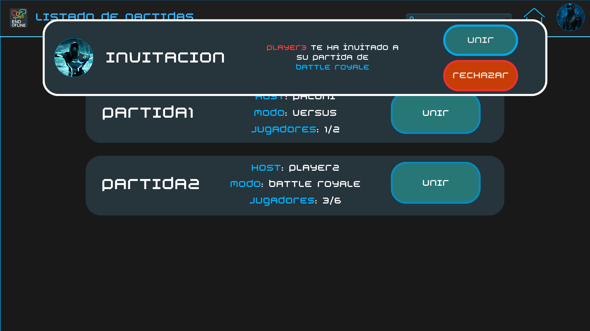
**Como** jugador  
**quiero** unirme a una partida mediante una invitación   
**para** poder jugar una partida con mis amigos.

#### Descripción detallada
Se mostrará un mensaje con la invitación donde se pueda aceptar o rechazar la invitación. Si se acepta redirigirá al jugador al lobby correspondiente, si se rechaza se ocultará el mensaje de invitación. 

#### Restricciones
- Jugador **autenticado**.  
- Invitación de un amigo 

#### Escenarios

**Positivo:**  
- Presiona el boton de aceptar y entar el lobby de dicha partida.
- Presiona el boton de rechazar y se elimina el mensaje de invitación.
- 
**Negativo:**  
- Si la partida ya ha comenzado, no permitirá unirse.
- Si la partida ya está completa, no permitirá unirse
---

### HU-24 – Inicio de partida
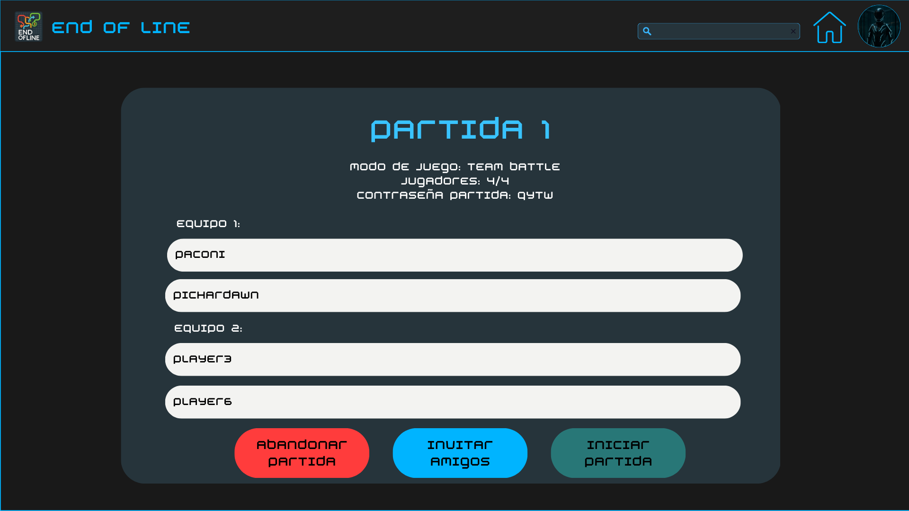
**Como** propietario de una partida  
**quiero** poder empezar esta misma    
**para** poder jugar con el resto de jugadores.

#### Descripción detallada
En el lobby habrá un botón para empezar la partida, que al presionarlo si eres el host de la partida, esta misma se creará correctamente y se podrá jugar con el resto de jugadores

#### Restricciones
- Jugador **autenticado**.  
- Ser el propietario de la partida

#### Escenarios

**Positivo:**  
- Presiona el boton de inicio y se crea la partida correctamente

## 3 ESTADÍSTICAS

### HU-25 – Visualización del listado de estadísticas de partidas jugadas
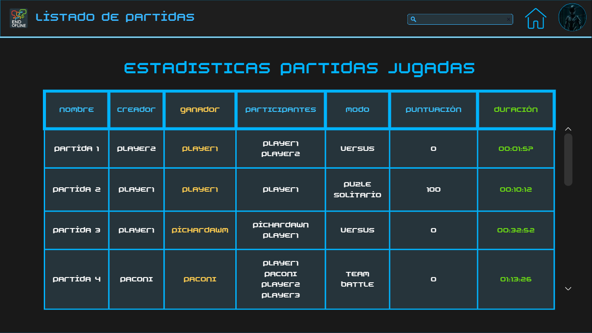
**Como** jugador  
**quiero** ver el historial de mis partidas y sus estadísticas  
**para** registrar mi trayectoria como jugador.

#### Descripción detallada
Se mostrará una lista con:  
**Creador**, **Nombre**, **Modo**, **Participantes**, **Ganador**, **Hora inicio/fin**, **Duración**, **Puntos obtenidos**.

#### Restricciones
- Solo partidas/estadísticas del **jugador autenticado**.

#### Escenarios

**Positivo:**  
- Muestra correctamente la lista con estadísticas (p.ej., 2 partidas → lista de longitud 2).

**Negativo:**  
- No muestra listado si el usuario no tiene partidas o no está autenticado.

---

### HU-26 – Listado de logros
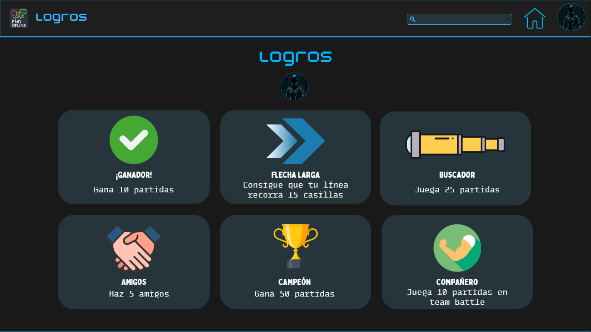
**Como** jugador  
**quiero** ver el listado de mis logros  
**para** llevar un control de mis objetivos alcanzados.

#### Descripción detallada
Se mostrará una lista de **logros obtenidos** en todos los modos de juego.

#### Restricciones
- Usuario autenticado con **rol jugador**.  
- Solo logros **vinculados** al usuario.

#### Escenarios

**Positivo:**  
- Se muestran correctamente los logros del usuario.

**Negativo:**  
- No se muestran logros si no tiene ninguno o si accede sin autenticarse.

---
### HU-27 – Listado de logros (administrador)
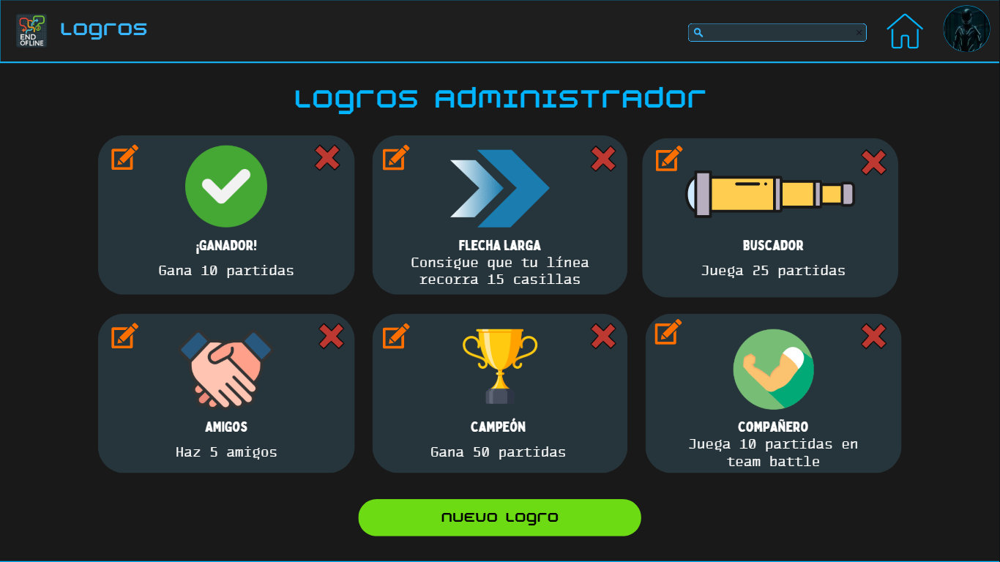
**Como** administrador   
**quiero** ver el listado de los logros registrados en el juego   
**para** poder editarlos o eliminarlos.

#### Descripción detallada
Se mostrará una lista de **logros** registrados en el juego con botones, uno para poder editarlo y otro para poder eliminarlo.

#### Restricciones
- Autenticación con **rol administrador**.  

#### Escenarios

**Positivo:**  
- Se muestran correctamente los logros del juego.

**Negativo:**  
- No se muestran logros si accede sin autenticarse como administrador.

---
### HU-28 – Crear logro (administrador)
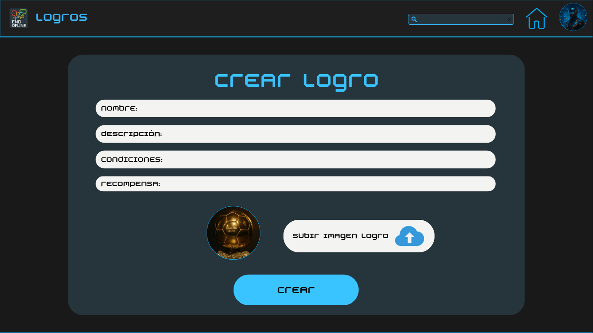
**Como** administrador  
**quiero** crear nuevos logros  
**para** que los usuarios puedan alcanzar nuevos objetivos.

#### Descripción detallada
Al pulsar **“Crear Logro”**, el sistema mostrará formulario con **nombre**, **descripción**, **condiciones** y **recompensa**. Al confirmar, se guarda en BD.

#### Restricciones
- Autenticación con **rol administrador**.  
- Campos obligatorios completos (**nombre** y **condición mínima**).

#### Escenarios

**Positivo:**  
- El administrador envía datos válidos y el sistema guarda el logro.

**Negativo:**  
- Si hay campos obligatorios vacíos o datos inválidos, se muestra error y no se guarda.

---

### HU-29 – Eliminar logro (administrador)
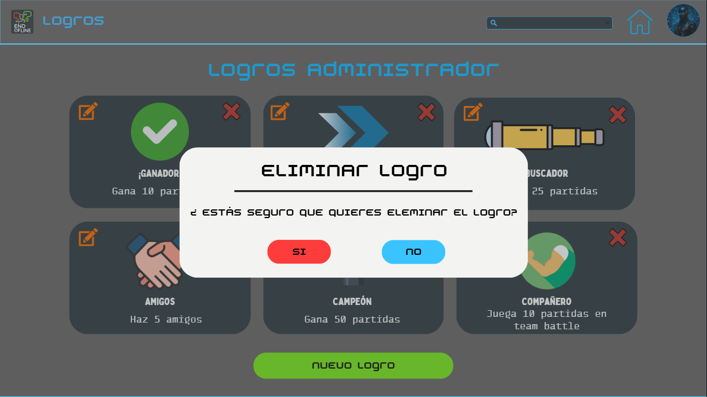
**Como** administrador  
**quiero** eliminar un logro  
**para** que los jugadores ya no puedan optar a él.

#### Descripción detallada
Al pulsar **“Eliminar Logro”**, se pide **confirmación** en un modal. Si confirma, se **elimina** de la BD.

#### Restricciones
- Autenticado con **rol administrador**.  
- Solo se eliminan **logros existentes**.

#### Escenarios

**Positivo:**  
- El administrador confirma y el sistema elimina el logro.

**Negativo:**  
- Si se **cancela** la confirmación, no hay cambios.

---

### HU-30 – Editar logro (administrador)
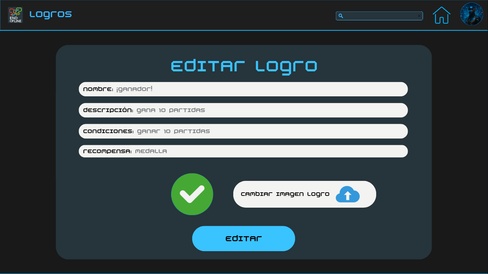
**Como** administrador  
**quiero** editar un logro existente  
**para** actualizar sus condiciones y motivar a los jugadores.

#### Descripción detallada
Al pulsar **“Editar Logro”**, se muestra formulario **precargado** (nombre, descripción, condición, recompensa). Se valida y se actualiza en BD.

#### Restricciones
- Autenticado con **rol administrador**.  
- Sin cadenas vacías en obligatorios ni datos incompatibles (p.ej., condición no numérica).

#### Escenarios

**Positivo:**  
- Con datos válidos, el sistema actualiza el logro.

**Negativo:**  
- Con datos inválidos, se muestra error y no se guardan cambios.

---

### HU-31 - Observar progreso (administrador)
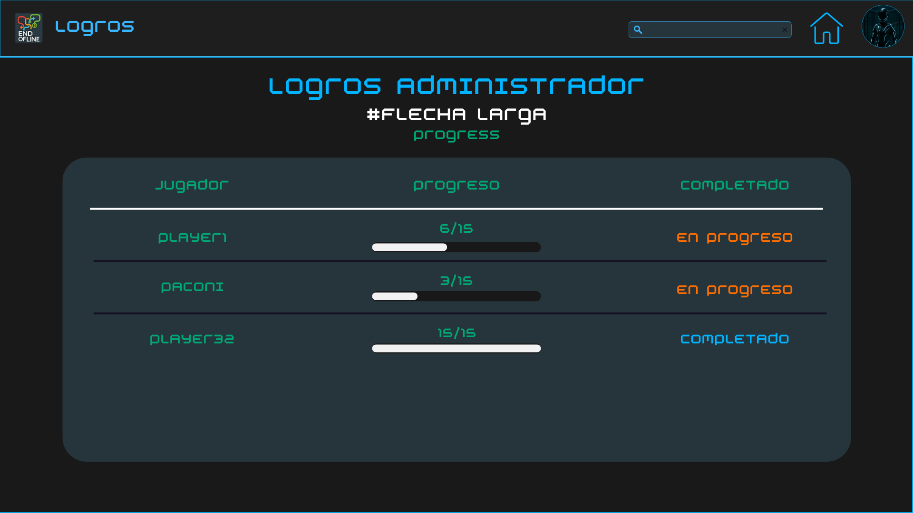
**Como** administrador  
**quiero** observar el progreso de los jugadores de un logro en especifico  
**para** ver el ranking de ese logro.

#### Descripcion detallada
Desde la seccion de logros, el administrador selecciona un logro y el sistema muestra el progreso de cada jugador y el ranking ordenado de ese logro.

#### Restricciones
- Autenticado con **rol administrador**.  
- El logro seleccionado debe existir.  
- Los datos del ranking deben estar actualizados.

#### Escenarios

**Positivo:**  
- El administrador selecciona un logro y ve el ranking con el progreso de los jugadores.

**Negativo:**  
- Si el logro no existe o no hay progreso registrado, se muestra un mensaje informativo.

---

### HU-32 – Visualización de rankings
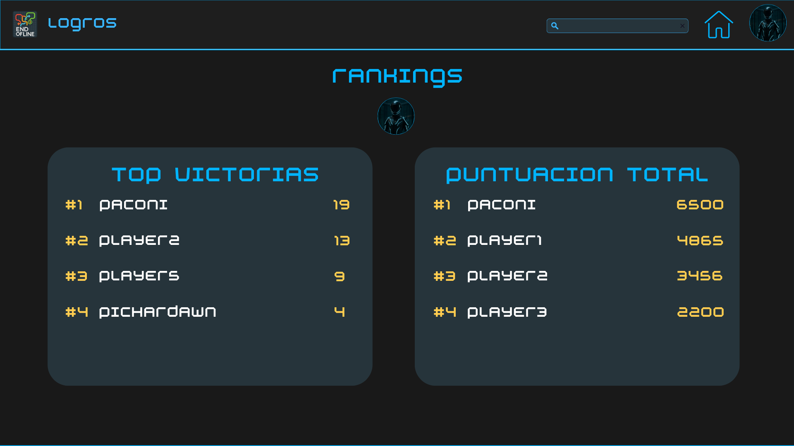
**Como** jugador  
**quiero** visulizar un ranking de estadisticas  
**para** comparar mi progreso con los demás jugadores.

#### Descripción detallada
Dependiendo de la estadísticas que quieras se mostrará un ranking con esas puntuaciones con todos los jugadores del juego y saber como has progresado en él.

#### Restricciones
- Autenticado con **rol jugador**.  

#### Escenarios

**Positivo:**  
- Seleccionas tu estadística, y muestra un ranking con los demás jugadores.

**Negativo:**  
- Si no estás autenticado no podrás visualizar tus estadísticas y la de los demás jugadores.

---

## 5 JUEGO SOCIAL

### HU-33 – Buscar jugadores
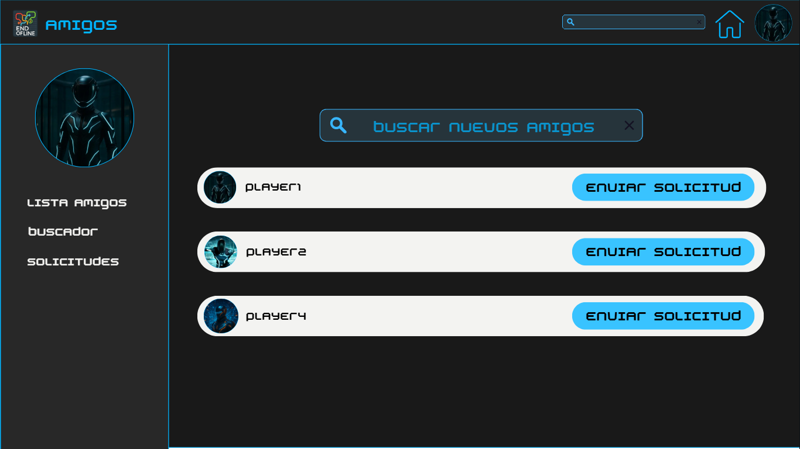
**Como** jugador  
**quiero** buscar por nombre/alias de otro jugador no amigo  
**para** poder mandarle una solicitud de amistad.

#### Descripción detallada
Campo de búsqueda en sección social; consulta BD y devuelve coincidencias.

#### Restricciones
- Usuario **autenticado** con rol **jugador**.  
- No listar **amigos** ni **solicitudes pendientes**.

#### Escenarios

**Positivo:**  
- Con nombre válido, devuelve resultados.

**Negativo:**  
- Con nombre inexistente, muestra **“No se han encontrado jugadores”**.

---

### HU-34 – Gestionar amigos
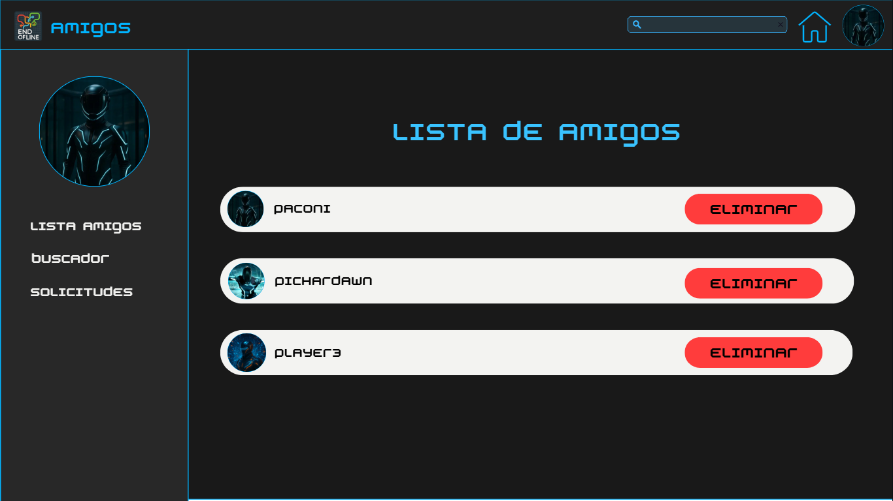
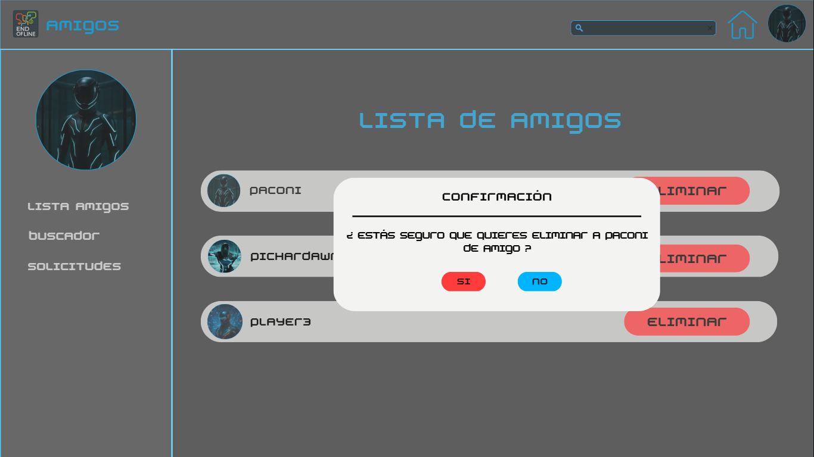

**Como** jugador  
**quiero** ver a mis amigos y poder eliminar vínculos  
**para** gestionar mis amistades.

#### Descripción detallada
Lista de amigos con opción **“Eliminar Amigo”** → modal de **confirmación** → si acepta, se **elimina** el vínculo en BD.

#### Restricciones
- Usuario **autenticado** con rol jugador.  
- Solo se pueden eliminar **amistades existentes**.

#### Escenarios

**Positivo:**  
- Muestra lista → pulsa “Eliminar Amigo” → confirma → vínculo eliminado correctamente.

**Negativo:**  
- Error si se intenta eliminar una **amistad inexistente**.  
- Error si alguno de los **jugadores no existe** en BD.

---

### HU-35 – Mandar solicitud de amistad

**Como** jugador  
**quiero** mandar solicitud de amistad a otro jugador  
**para** establecer una relación de amistad.

#### Descripción detallada
Desde búsqueda, seleccionar usuario y enviar solicitud → se registra como **pendiente** hasta aceptación/rechazo.

#### Restricciones
- Solo **jugadores autenticados**.  
- No enviar a **uno mismo**.  
- No enviar a jugadores ya **amigos** o con **solicitud pendiente**.

#### Escenarios

**Positivo:**  
- Jugador autenticado envía solicitud válida a jugador existente → se registra **pendiente**.

**Negativo:**  
- Un **administrador** intenta acceder al módulo social → error.  
- Si alguno de los usuarios **no existe** → error.  
- Si se intenta enviar a **uno mismo** → bloqueado.  
- Si ya existe **amistad** o **pendiente** → rechazado.

---

### HU-36 – Responder a una solicitud de amistad
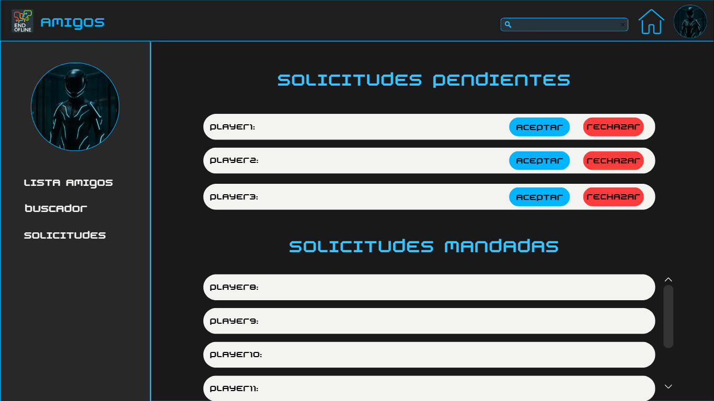
**Como** jugador  
**quiero** aceptar o rechazar solicitudes pendientes  
**para** decidir mis amistades.

#### Descripción detallada
Listado de **solicitudes recibidas** con opciones **Aceptar** (crea amistad) / **Rechazar** (descarta y guarda como rechazada).

#### Restricciones
- Usuario **autenticado** con rol jugador.  
- Solicitud debe existir y estar **pendiente**.

#### Escenarios

**Positivo:**  
- Acepta → crea relación de amistad en BD.  
- Rechaza → descarta la solicitud.

**Negativo:**  
- Error si usuarios no existen.  
- Error si la solicitud **no está registrada**.  
- Error si **ya existía amistad** antes de responder.

---

### HU-37 – Comprobar solicitudes pendientes

**Como** jugador  
**quiero** ver solicitudes enviadas y recibidas pendientes  
**para** gestionar mi bandeja social.

#### Descripción detallada
Dos listados: **Enviadas (pendientes)** y **Recibidas (pendientes)**.

#### Restricciones
- Usuario **autenticado** con rol jugador.  
- Solo solicitudes **vinculadas** al usuario.

#### Escenarios

**Positivo:**  
- Muestra correctamente enviadas y recibidas en estado **pendiente**.

**Negativo:**  
- No muestra si el usuario no tiene ninguna, o si se intenta acceder a **otro usuario**.

---

### HU-38 – Notificación de amigos en línea
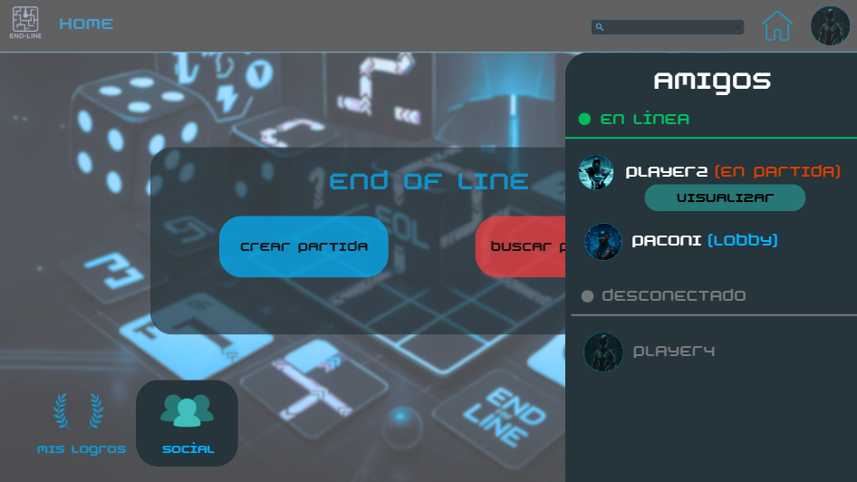

**Como** jugador  
**quiero** ver qué amigos están conectados en la **página de inicio**  
**para** interactuar con ellos fácilmente.

#### Descripción detallada
Lista dinámica de amigos **conectados**, actualizada en **tiempo real** (en línea / desconectado / en partida).

#### Restricciones
- Usuario **autenticado**.  
- Solo **amigos confirmados**.

#### Escenarios

**Positivo:**  
- Muestra correctamente los amigos en línea.

**Negativo:**  
- Si no hay amigos conectados, mensaje **“Ningún amigo está en línea actualmente”**.

---

### HU-39 – Modo espectador de amigos

**Como** jugador  
**quiero** unirme como espectador a partidas de mis amigos  
**para** verlas sin participar.

#### Descripción detallada
Opción **“Ver partida”** disponible cuando **todos los jugadores** de esa partida son **amigos** del usuario. Se abre en modo **visualización** (sin interacción).

#### Restricciones
- Usuario **autenticado**.  
- Ser **amigo de todos** los jugadores.  
- Es **solo observación** (sin interacción).

#### Escenarios

**Positivo:**  
- Cumple requisitos y accede como espectador.

**Negativo:**  
- Si no es amigo de todos, se **bloquea** y se muestra error.

---

### HU-40 – Chat público durante partidas
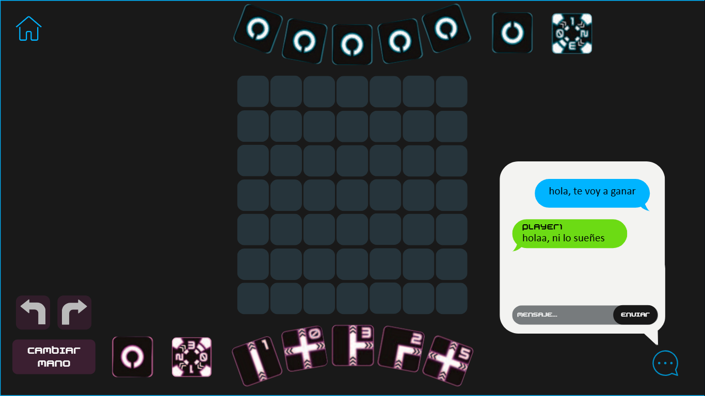
**Como** jugador  
**quiero** escribir y leer mensajes en un **chat público**  
**para** interactuar con jugadores y espectadores durante la partida.

#### Descripción detallada
Panel de chat en pantalla de partida. Mensajes en **tiempo real** visibles para todos en la sala.

#### Restricciones
- Estar en una **partida** (jugando o espectador).  
- **Moderación** para evitar lenguaje ofensivo.  
- No enviar **mensajes vacíos** ni **excesivamente largos**.

#### Escenarios

**Positivo:**  
- Mensajes válidos se muestran en tiempo real a todos los participantes.

**Negativo:**  
- Mensajes vacíos/largos/prohibidos → **rechazados** con error.

---

## 6 HISTORIAS DE CÓMO JUGAR

### HU-41 – Asignación color de partida

**Como** jugador  
**quiero** que se me asocie un color al empezar la partida  
**para** asociarlo a mis cartas y elementos de juego.

#### Descripción detallada
Antes de la partida, el sistema asigna automáticamente a los jugadores colores distintos:
- El sistema reparte **todas las cartas de línea** del color, las **baraja** y forma el **mazo virtual**.  
- Coloca la **carta de energía** con valor inicial **3** hacia arriba.  
- Coloca la **carta de inicio** en la posición predefinida.

#### Restricciones
- Cada color solo puede ser asignado por **un jugador**.  
- Debe seleccionarse **antes** de continuar la configuración.  
- Colocaciones **automáticas** (sin intervención manual).

#### Escenarios

**Positivo:**  
- Al jugador se le asigna un color disponible y se asignan correctamente sus cartas.

**Negativo:**  
- Si el color ya esta asignado, se le asignará otro diferente

---

### HU-42 – Determinar orden de turno en primera ronda
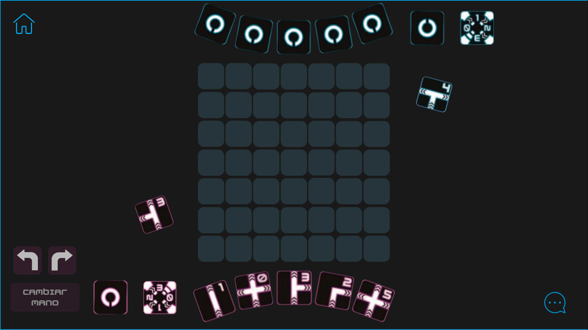
**Como** jugador  
**quiero** que el sistema determine automáticamente la **iniciativa**  
**para** decidir quién empieza en la primera ronda.

#### Descripción detallada
El sistema revela la **primera carta** del mazo de cada jugador y compara **iniciativa**. El valor **más bajo** empieza. Si hay **empate**, se repite con una carta adicional hasta resolver. Luego devuelve cartas a mazos, **baraja** y reparte **5 cartas** iniciales.

#### Restricciones
- Mazos **cargados** en la partida.  
- Barajado y revelación **automáticos y visibles**.

#### Escenarios

**Positivo:**  
- Se determina correctamente el jugador inicial y se reparten manos.

**Negativo:**  
- Si un mazo no está disponible o hay interrupción, muestra error y **reinicia** fase.

---

### HU-43 – Determinar orden de turno en rondas posteriores
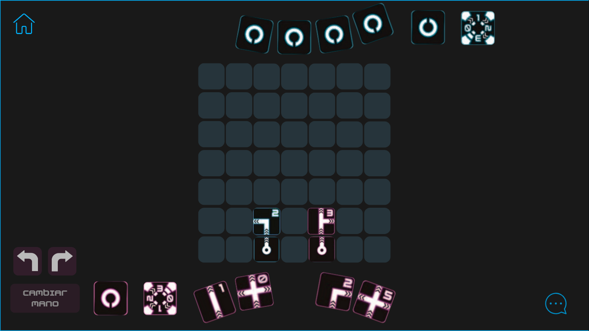
**Como** jugador  
**quiero** que el sistema resuelva automáticamente el orden de turno  
**para** las rondas distintas a la primera.

#### Descripción detallada
El sistema detecta la **última carta** jugada por cada jugador y compara su **iniciativa**. El valor **más bajo** empieza la nueva ronda.

#### Restricciones
- Los jugadores deben tener la **longitud de su línea igual** (regla del juego).

#### Escenarios

**Positivo:**  
- Se determina correctamente quién empieza la ronda entrante.

**Negativo:**  
- Si falta la **última carta** (no se jugó), no se detecta **iniciativa**.

---

### HU-44 – Empate de iniciativa
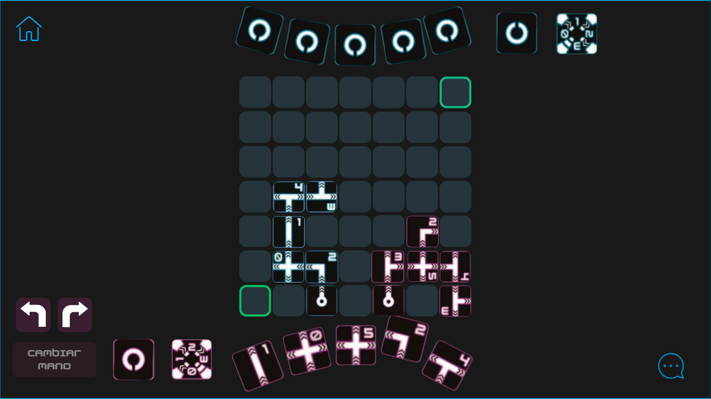

**Como** jugador  
**quiero** que el sistema resuelva empates de iniciativa  
**para** evitar bloqueos.

#### Descripción detallada
Ante empate, el sistema revisa **la última carta jugada** por cada jugador y retrocede hacia anteriores hasta desempatar. Si persiste, se usa el **orden inicial** tomado antes de la primera ronda.

#### Restricciones
- Solo participan los jugadores **empatados**.

#### Escenarios

**Positivo:**  
- El sistema resuelve el empate y determina el jugador inicial.

**Negativo:**  
- No hay caso negativo: el sistema **siempre** resuelve el desempate.

---

### HU-45 – Cambio de mano inicial
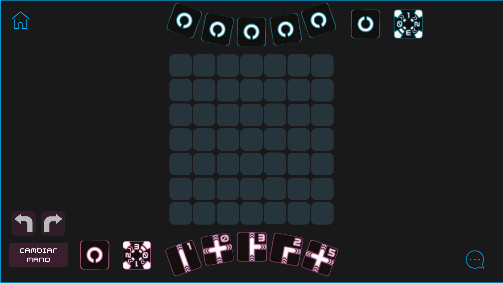

**Como** jugador  
**quiero** poder cambiar mi mano inicial una vez  
**para** renovar si no estoy conforme.

#### Descripción detallada
Tras robar **5 cartas**, el jugador puede pulsar **“Cambiar mano”** (solo antes de la primera ronda). El sistema devuelve la mano al mazo, **baraja** y reparte **5 nuevas cartas** que deben **conservarse**.

#### Restricciones
- Solo **una vez** al inicio.  
- Se cambia la **mano completa**, no cartas sueltas.

#### Escenarios

**Positivo:**  
- Pulsa “Cambiar mano” y recibe 5 nuevas cartas.

**Negativo:**  
- Si ya usó el cambio, se **bloquea** la acción.

---

### HU-46 – Echar carta

**Como** jugador  
**quiero** seleccionar una carta de mi mano y jugarla en el tablero  
**para** ejecutar su acción.

#### Descripción detallada
El jugador selecciona una carta. El sistema **resalta** casillas disponibles; al elegir una, la carta se **coloca** automáticamente.

#### Restricciones
- Debe ser **su turno**.  
- Debe tener **cartas** para jugar.

#### Escenarios

**Positivo:**  
- Selecciona carta válida → se muestran casillas válidas → se coloca correctamente.

**Negativo:**  
- Si intenta jugar **fuera de turno** o sin cartas, el sistema **rechaza** la acción con error.

---

### HU-47 – Robar cartas
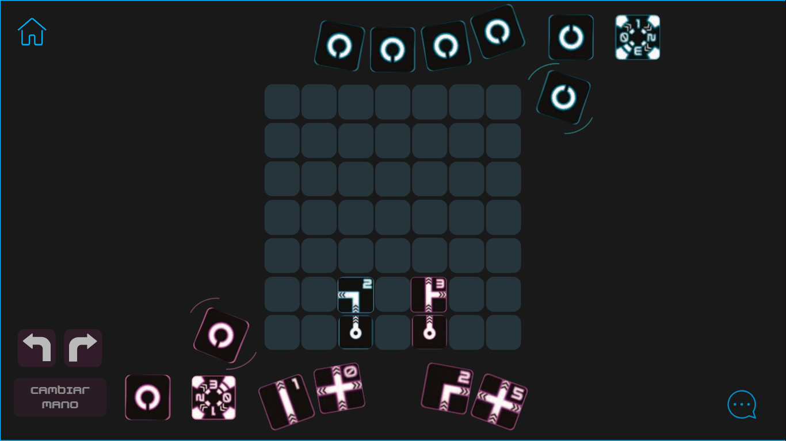
**Como** jugador  
**quiero** completar mi mano hasta **5** cartas  
**para** continuar la partida.

#### Descripción detallada
Al finalizar la **fase de acción** de la ronda, el sistema añade automáticamente cartas desde el mazo hasta tener **5** en mano. (Opcionalmente, botón “Robar” si procede en UI).

#### Restricciones
- No superar **5 cartas** en mano.  
- No robar si el **mazo está vacío** o **no ha acabado** la fase de acción.

#### Escenarios

**Positivo:**  
- Se completan las cartas hasta **5**.

**Negativo:**  
- Si ya hay 5 cartas o no es fase de robo, se **bloquea** la acción.

---

### HU-48 – Usar carta de energía
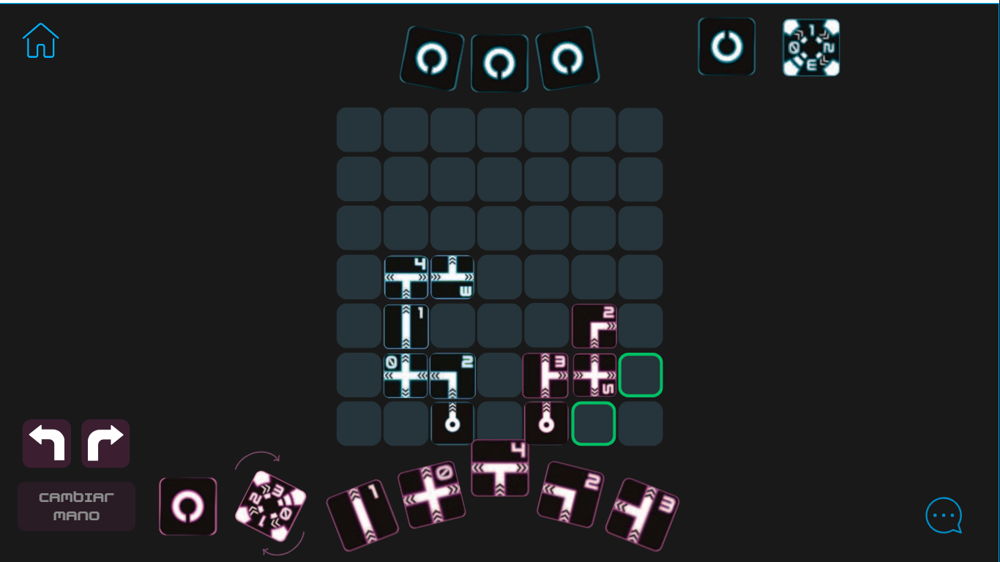
**Como** jugador  
**quiero** usar una carta de energía en mi turno  
**para** activar su ventaja.

#### Descripción detallada
Antes de jugar carta de mano, el jugador pulsa la **carta de energía** y aparece modal con **energías disponibles**. Selecciona y confirma **“Usar energía”**. El sistema **inclina** la carta 90° y la **bloquea**.

#### Restricciones
- Debe ser **su turno**.  
- **Una** carta de energía por turno.  
- Usables **a partir de la ronda 3**.  
- Cada carta de energía se usa **una única vez**.

#### Escenarios

**Positivo:**  
- Usa la carta → se actualiza estado y queda **bloqueada**.

**Negativo:**  
- Si intenta usar más de una o reutilizar, el sistema **rechaza** la acción.

---

### HU-49 – Despliegue de dos cartas a partir de la segunda ronda
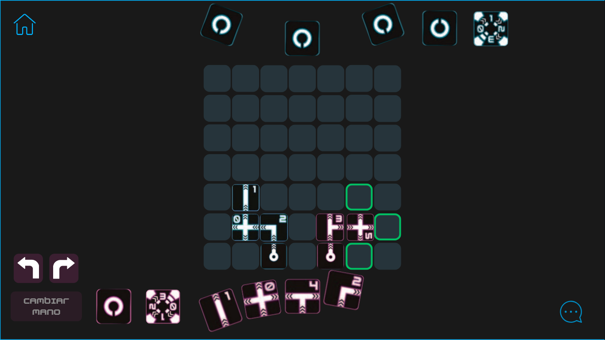
**Como** jugador  
**quiero** poder jugar **dos cartas de línea** por ronda desde la **segunda**  
**para** ajustarme a las reglas del juego.

#### Descripción detallada
El sistema detecta que ya pasó la **primera ronda**. El jugador puede **usar dos cartas consecutivas** sin turno intermedio del rival.

#### Restricciones
- Debe ser **su turno**.  
- Estar en **ronda posterior** a la primera.

#### Escenarios

**Positivo:**  
- Juega dos cartas seguidas y se actualiza el tablero.

**Negativo:**  
- En la **primera ronda**, tras una carta, pasa el turno al rival (regla).

---

### HU-50 – Tablero ortogonal

**Como** jugador  
**quiero** que el tablero conecte sus **límites ortogonalmente** (derecha/izquierda y arriba/abajo)  
**para** poder continuar mi línea a través de los bordes.

#### Descripción detallada
El sistema conecta los límites del tablero **ortogonalmente**. Al intentar seguir la línea en un borde, se activan casillas válidas donde las **salidas** coincidan con **entradas** por el lado opuesto.

#### Restricciones
- Debe ser **su turno**.

#### Escenarios

**Positivo:**  
- Puede usar los **límites** para continuar su línea.

**Negativo:**  
- Si los bordes de la carta en el límite **no tienen salida**, no puede continuar por el borde.

---

### HU-51 – Girar las cartas de línea

**Como** jugador  
**quiero** cambiar la **rotación** de mis cartas de línea  
**para** ajustarlas a la casilla disponible del tablero.

#### Descripción detallada
Al seleccionar una carta de línea (antes de colocarla), se activan dos botones para **girar 90°** a derecha o izquierda.

#### Restricciones
- Debe estar **seleccionada** la carta.  
- Se debe **rotar antes** de colocarla.

#### Escenarios

**Positivo:**  
- Usa los botones para rotar y coloca la carta en una casilla válida.

**Negativo:**  
- Si intenta girar **después** de colocarla, los botones están **bloqueados** y no puede rotar.

---

### HU-52 – Final de partida
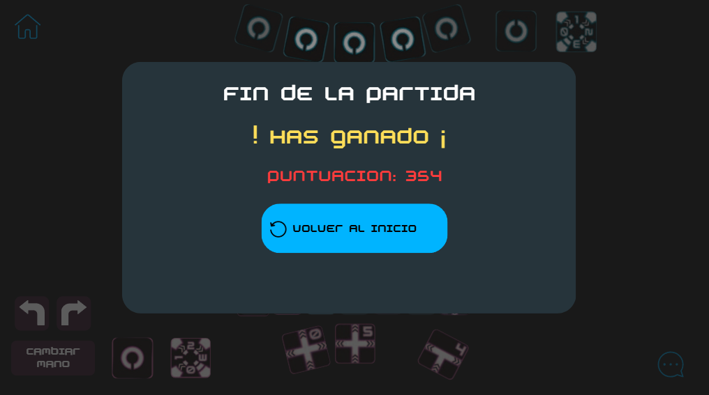

**Como** jugador  
**quiero** ver los resultados de la partida
**para** saber si he ganado o he perdido.

#### Descripción detallada
Al acabar una partida se mostrará si has ganado o has perdido la partida

#### Restricciones
- Debe estar la partida terminada.

#### Escenarios

**Positivo:**  
- La partida termina y cada jugador observa su resultado en la partida

## Diagrama conceptual del sistema

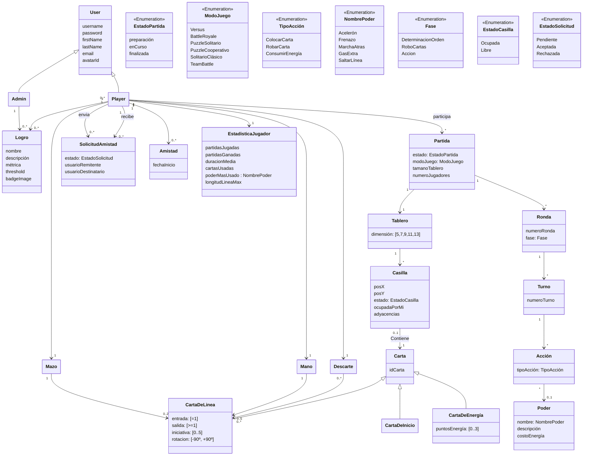
```mermaid
---
  config:
    class:
      hideEmptyMembersBox: true
---
classDiagram
    User <|-- Admin
    User <|-- Player

    Admin "1" --> "0..*" Logro
    Player "0..*" --> "0..*" Logro

    Player "*" --> "*" Partida : participa
    Partida "1" --> "1" Tablero
    Partida "1" --> "*" Ronda
    Ronda "1" --> "*" Turno
    Turno "1" --> "*" Acción
    Acción "*" --> "0..1" Poder

    Tablero "1" --> "*" Casilla
    Casilla "0..1" --> "1" Carta : Contiene

    Player "1" --> "1" Mazo
    Player "1" --> "1" Mano
    Player "1" --> "1" Descarte

    Player "1" --> "0..*" SolicitudAmistad : envia
    Player "1" --> "0..*" SolicitudAmistad : recibe
    Player "1" --> "0..*" Amistad

    Player "1" --> "1" EstadisticaJugador

    Mazo "1" --> "0..25" CartaDeLinea
    Mano "1" --> "0..5" CartaDeLinea
    Descarte "0..*" --> "0..*" CartaDeLinea

    Carta <|-- CartaDeLinea
    Carta <|-- CartaDeInicio
    Carta <|-- CartaDeEnergía

    class User{
        username
        password
        firstName
        lastName
        email
        avatarId    
    }
    class Player{ 
    }
    class Admin{
    }
    class Logro{
        nombre
        descripción
        métrica
        threshold
        badgeImage
    }
    class EstadisticaJugador {
        partidasJugadas
        partidasGanadas 
        duracionMedia 
        cartasUsadas
        poderMasUsado : NombrePoder
        longitudLineaMax
    }
     class Partida{
        estado: EstadoPartida
        modoJuego: ModoJuego
        tamanoTablero
        numeroJugadores
    }
    class Ronda{
        numeroRonda
        fase: Fase
    }
    class Tablero{
        dimensión: [5,7,9,11,13]
    }
    class Casilla{
        posX
        posY
        estado: EstadoCasilla
        ocupadaPorMi
        adyacencias
    }
    class Turno{
        numeroTurno
    }
    class Acción{
        tipoAcción: TipoAcción
    }
    class Poder{
        nombre: NombrePoder
        descripción
        costoEnergía
    }
    class Carta{
        idCarta
    }
    class CartaDeLinea{
        entrada: [=1]
        salida: [>=1]
        iniciativa: [0..5]
        rotacion: [-90º, +90º]
    }
    class CartaDeInicio{
    }
    class CartaDeEnergía{
        puntosEnergía: [0..3]
    }
    class Mazo{
    }
    class Mano{
    }
    class Descarte{
    }
    class Amistad{
        fechaInicio
    }
    class SolicitudAmistad{
        estado: EstadoSolicitud
        usuarioRemitente
        usuarioDestinatario
    }
    class EstadoPartida{
        <<Enumeration>>
        preparación
        enCurso
        finalizada
    }
    class ModoJuego{
        <<Enumeration>>
        Versus
        BattleRoyale
        PuzzleSolitario
        PuzzleCooperativo
        SolitarioClásico
        TeamBattle
    }
    class TipoAcción{
        <<Enumeration>>
        ColocarCarta
        RobarCarta
        ConsumirEnergía
    }
    class NombrePoder{
        <<Enumeration>>
        Acelerón
        Frenazo
        MarchaAtras
        GasExtra
        SaltarLínea
    }
    class Fase{
        <<Enumeration>>
        DeterminacionOrden
        RoboCartas
        Accion
    }
    class EstadoCasilla{
        <<Enumeration>>
        Ocupada
        Libre
    }
    class EstadoSolicitud{
        <<Enumeration>>
        Pendiente
        Aceptada
        Rechazada
    }

```
_Si vuestro diagrama se vuelve demasiado complejo, siempre podéis crear varios diagramas para ilustrar todos los conceptos del dominio. Por ejemplo podríais crear un diagrama para cada uno de los módulos que quereis abordar. La única limitación es que hay que ser coherente entre unos diagramas y otros si nos referimos a las mismas clases_

_Puede usar la herramienta de modelado que desee para generar sus diagramas de clases. Para crear el diagrama anterior nosotros hemos usado un lenguaje textual y librería para la generación de diagramas llamada Mermaid_

_Si deseais usar esta herramienta para generar vuestro(s) diagramas con esta herramienta os proporcionamos un [enlace a la documentación oficial de la sintaxis de diagramas de clases de _ermaid](https://mermaid.js.org/syntax/classDiagram.html)_

## Reglas de Negocio

### R1 – Condición de victoria/derrota Team Battle y Versus/ Battle Royale
Un jugador/equipo es eliminado si no puede colocar ninguna carta de línea para continuar su recorrido. El oponente se declara ganador/es.

### R2 – Victoria / Derrota en puzzle solitario / Solitario Clásico
Un jugador es ganador del puzzle cuando cubre la totalidad del área de juego. Un jugador es derrotado en caso contrario.

### R3 – Límites del área de juego 
El sistema debe restringir la colocación de cartas de línea dentro de la cuadrícula establecida según el número de jugadores y el modo de juego. No se permite la colocación fuera de esos límites.

### R4 - Límites laterales
Los límites laterales están conectados ortogonalmente (Arriba - Abajo; Izquierda - Derecha). Estos se determinan con la colocación de las cartas de línea de los jugadores.

### R5 – Continuidad de las líneas
Cada carta de línea jugada debe conectarse de manera válida: la entrada de la carta debe coincidir con alguna salida disponible de la última carta colocada. No se permite colocar cartas sin continuidad.

### R6 - Mano en todos los modos de juego excepto solitario clasico :
Cada jugador debe tener 5 cartas en mano antes de la fase de acción.

### R7 - Inicio de partida :
Al empezar la partida cada jugador debe tener un mazo de 25 cartas de línea, 1 carta de salida y 1 carta de energía. 

### R8 – Determinación del orden de turno 
Empieza la ronda el jugador con iniciativa menor de la última carta jugada (desempatando en la penúltima carta si es necesario). En el caso de la primera ronda, el que saque menor iniciativa comienza. En caso de llegar hasta la carta de inicio sin desempate, se mantiene el orden inicial de la primera ronda.

### R9 – Secuencia de fases de ronda
El sistema debe forzar que cada ronda se ejecute en el orden:
Fase de Orden de turno
Fase de Robo (Hasta 5 cartas en mano)
Fase de Acción 

### R10 – Colocación obligatoria de cartas
En la primera ronda, cada jugador debe colocar 1 carta de línea a continuación de su carta de inicio. En rondas posteriores, cada jugador coloca obligatoriamente 2 cartas, salvo que use un efecto de Energía.

### R11 - Fin de Ronda
La ronda se considera finalizada cuando ambos jugadores hayan colocado sus cartas de línea.

### R12 – Gestión de la Energía
Solo se puede usar una carta de energía por ronda, a partir de la ronda 3. Cada jugador tiene 3 puntos de energía al comenzar. El sistema debe impedir el uso de más de un efecto por ronda o el gasto de más energía de la disponible.

### R13 - Efecto de Acelerón
Consume 1 punto de energía para colocar 3 cartas de línea (en vez de 2). Para activar este efecto, girar la carta de energía correspondiente 90 grados en sentido horario.

### R14 - Efecto de Frenazo
Consume 1 punto de energía para colocar 1 carta de línea (en vez de 2). Para activar este efecto, girar la carta de energía correspondiente 90 grados en sentido horario.

### R15 - Efecto de Marcha Atrás
Consume 1 punto de energía para continuar la línea desde una salida disponible en la penúltima carta de línea colocada (en vez de la última). Para activar este efecto, girar la carta de energía correspondiente 90 grados en sentido horario.

### R16 - Efecto de Gas Extra
Consume 1 punto de energía para robar una carta de línea adicional. Para activar este efecto, girar la carta de energía correspondiente 90 grados en sentido horario.

### R17 - Efecto de Saltar Linea Compañera (Solo modo Team Battle)
Consume 1 punto de energía para saltarse la línea de su compañero de equipo (solo 1 carta de línea). Para activar este efecto, girar la carta de energía correspondiente 90 grados en sentido horario.

### R18 – Puntuación en modo Puzzle Solitario/Cooperativo/Solitario Clásico
La puntuación se calculará como: Iniciativa de cartas sobrantes + Energía no gastada.

### R19 – Secuencia de fases de ronda en modo Solitario Clásico
El sistema debe forzar que cada ronda se ejecute en el orden:
Fase de Robo Alternativa
Fase de Acción 

### R20 – Inicio partida en modo Solitario Clásico
Comienzo sin cartas en la mano y robo de cartas de una en una. Mazo donde escoger carta y mazo de descartes

### R21 - Decisiones en modo Solitario Clásico
Hay dos posibilidades: utilizar una carta del mazo normal o una carta de linea del mazo de descartes

### R22 – Continuidad en modo Team Battle
Los jugadores no pueden continuar la línea de un compañero

## Descripción del orden en el que se irán aborandando las distintas historias de usuario:
En primer lugar, para el Sprint 1,  hicimos las historias de usuario referidas a la Gestión de usuarios, de la HU-01 hasta la HU-10, ya que era nuestro primer objetivo, ya que era necesario para poder implementar las demás historias de usuario.

Continuamos dividiendonos en parejas por modulos, para el Sprint 2, ahi comenzaron a realizar de forma paralela, el modulo de jugabilidad con las HU-11, HU-18, HU-19, HU-20, HU-21, HU-24; conforme al modulo de estadísticas, las HU-25, HU-26, HU-27, HU-28, HU-29, HU-30; finalmente el modulo social, las HU-33, HU-34, HU-35, HU-36, HU-37.

Para el Sprint 3 quisimos realizar el mayor número de HU posibles para que en el Sprint 4 pudiesemos pulir todo, por tanto hicimos las siguiente HU: HU-12, HU-14, HU-15, HU-24, HU-31, HU-32, HU-38, HU-39, HU-40, HU-41, HU-42, HU-43, HU-44, HU-45, HU-46, HU-47, HU-48, HU-49, HU-50, HU-51

Para terminar, en el Sprint 4 hicimos las HU restantes: HU-13, HU-17, HU-22, HU-23

