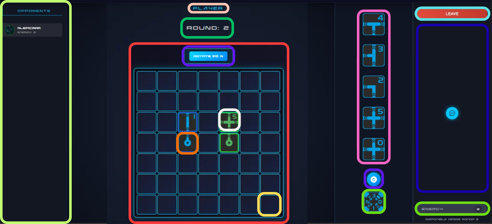

# Documento de diseño del sistema
**Asignatura:** Diseño y Pruebas (Grado en Ingeniería del Software, Universidad de Sevilla)  
**Curso académico:** 2025/2026
**Grupo/Equipo:** L5-3 
**Nombre del proyecto:** End Of Line
**Repositorio:** [https://github.com/gii-is-DP1/dp1-2025-2026-l5-3-25.git] (http://github.com)
**Integrantes (máx. 6):** 
- **Álvaro de Pablos Sánchez** (wbk2747 / alvpapbsan@alum.us.es)  
- **Carmen Camacho Montes** (jbv8381 / carcammon@alum.us.es)  
- **Francisco Casasola Calzadilla** (qhr9543 / fracascal@alum.us.es)  
- **Alejandro Pichardo Martínez** (alepicmar / alepicmar@alum.us.es)  
- **Juan Pozo Gracia** (dkk2084 / juapozgar@alum.us.es)  
- **Nicolás Pérez Martín** (ygc9995 / nicpermar@alum.us.es)  


## Introducción

En este proyecto vamos a implementar el juego **End Of Line** de manera online, de manera que se facilite la jugabilidad entre jugadores sin material físico, garantizando la aplicación de las reglas de manera justa y automática.

El juego está diseñado principalmente para **2 jugadores** en su modo clásico (*versus*), aunque cuenta también con variantes que amplían la experiencia, con la posibilidad de jugar hasta **8 jugadores**:

- **Modo solitario/puzzle**: pensado para un solo jugador.  
- **Modo battle royale**: admite 3 o más jugadores de forma competitiva.  
- **Modo cooperativo/equipos**: los jugadores colaboran en equipos contra otros.  

**End of Line** es un juego de cartas para 2 o más jugadores, con una duración de entre **15 y 30 minutos** según el modo y cantidad de jugadores.  
Su objetivo principal es extender tu línea de cartas en el tablero, cortando la línea de tu oponente antes de que corte la tuya.

### Preparación del juego
- Se selecciona el modo de juego, proporcionando el tablero correspondiente según el número de jugadores
   1.  5x5 para 1 jugador
   2.  7x7 para 2-3 jugadores
   3.  9x9 para 4-5 jugadores
   4.  11x11 para 6-7 jugadores
   5.  13x13 para 8 jugadores
- Cada jugador recibe una carta de inicio, una carta de energía y un mazo de 25 cartas de línea.  

### Desarrollo de la partida
La partida se desarrolla por turnos, al comenzar la partida cada jugador obtiene 5 cartas de su mazo, si no está conforme puede barajarlas y obtener otras 5, se saca una carta fuera del tablero y el jugador con la iniciativa (número indicado en la esquina superior derecha de nuestra carta de línea) más baja empieza. Cada ronda tiene 3 fases: la primera se colocan las cartas de línea en el tablero, la segunda se roba el número de cartas de nuestro mazo para tener siempre 5 en nuestra mano y por último, se vuelven a comprar las iniciativas para saber el jugador que comienza la siguiente ronda. En la primera ronda solo usamos una carta sobre el tablero, a partir de la segunda usamos 2 y desde la tercera ronda, se habilitan los puntos de energía, proporcionando habilidades especiales.

Cada jugador dispone de 3 puntos de energía, y solo se podrá consumir 1 punto por ronda , a partir de la 3ª ronda. Las diferentes habilidades especiales son:
 - Acelerón: puedes usar una carta de línea más.
 - Frenazo: puedes usar solo una carta de línea.
 - Marcha atrás: puedes usar la salida de la penúltima carta echada en la ronda anterior
 - Gas extra: puedes robar una carta de línea adicional
 - Salto de línea (Solo disponible en el modo de juego Team Battle): puedes saltar la línea de tu compañero para poder continuar la tuya 


### Fin de la partida
La partida termina cuando un jugador queda **bloqueado**, de manera que no pueda realizar ningún movimiento.  
Cuando esto ocurre, se determina la victoria según el modo de juego:

- **Modo versus**: gana el jugador que haya bloqueado al oponente.  
- **Puzzle solitario**: consiste en cubrir la totalidad del área de juego 5x5 usando tu mazo sin cortar tu línea, la puntuación final será la suma de las iniciativas de tus cartas sobrantes y los puntos de energía restantes. (Hay diferentes puzzles para completar) 
- **Solitario Clásico**: tiene el mismo objetivo que el modo Puzzle Solitario, pero no hay fase de robo, empiezas sin cartas en la mano y vas robando las cartas de una en una, pudiendo usarlas y descartarlas boca arriba en una pila de descarte. Por lo que antes de robar podrás usar la primera carta de la pila
- **Puzzle Cooperativo**: tiene el mismo objetivo que el Puzzle Solitario, pero en este participan 2 o más jugadores
- **Battle Royale**: igual que el modo versus, pero con más de 2 jugadores hasta 8 como máximo
- **Team Battle**: este modo tiene las mismas reglas que el modo Versus, pero los jugadores jugarán en equipos y podrán usar el tipo de energía Salto de Línea, exclusivo para este modo. No se puede continuar la línea de tu compañero
  


[https://www.youtube.com/watch?v=5t18m8ePuo0] (http://youtube.com)

## Diagrama(s) UML:

### Diagrama de Dominio/Diseño

### Diagrama de Capas (incluyendo Controladores, Servicios y Repositorios)


**`1. DTOs`**
- GameSessionService --> **StartPositionDTO** , **GameStartDTO** , **PlaceCardRequestDTO** , **SpectatorGameDTO** , **GameSessionDTO**  
- PlayerAchievementService --> **PlayerAchievementDTO**
- PayerStatisticsService --> **PlayerRankingDTO** , **PlayerStatisticsDTO**
- ChatMessageService --> **ChatMessageDTO** , **ChatRequestDTO**
- PlayerCardService --> **PlayerCardDTO**
- FriendshipService --> **FriendshipDTO** , **FriendshipRequestDTO**
- PlacedCardService --> **PlaceCardRequestDTO**
- JoinGameService --> **GameSessionDTO** , **JoinRequestDTO**
- LeaveGameService --> **GameSessionDTO**
- GameInvitationService --> **JoinRequestDTO**

**`2. Querys`**
- GameSessionRepository --> @Query **findByIdWithPlayers** , **findByIdWithPlayersAndPlacedCards**
- AuthoritiesRepository --> @Query **findByName**
- UserRepository --> @Query **findAllByAuthority**
- PlayerAchievementRepository --> @Query **findByPlayerIdAndAchievementId** , **findCompletedByPlayerId**
- ChatMessageRepository --> @Query **findAllMessagesByGameId**
- PlayerCardRepository -- > @Query **countByPlayerAndLocationAndUsedFalse**
- CardTemplateRepository -- > @Query **findByType** , **findAllByType**
- PlayerRepository -- > @Query **existsPlayerById** , **findAllByAuthority**
- FriendshipRepository -- > @Query **findAllFriendshipsByPlayerId** , **findFriendshipBySenderAndReceiver** , **areTheyFriends**
- PlacedCardRepository -- > @Query **findByGameSessionId** , **findByRowAndColAndGameSessionId** , **countByGameSessionId**

## Descomposición del mockups del tablero de juego en componentes (Markdown)

## 1. Árbol de Jerarquía de Componentes (Tablero de juego)

- App (raíz)
  - index
    - [Left column]
      - OpponentCard (render por cada jugador rival) **Lima**
    - [Central column]
      - Header (Nombre de partida **Rosa**/ Ronda **Verde Oscuro**)
      - GameBoardComponent (Lógica de colocación) **Rojo**
        - Rotate (rotación de cartas) **Morado**
        - BoardCell
            - StartCard (carta de inicio del jugador) **Naranja**
            - PlacedCard (carta puesta en el tablero) **Blanco**
            - Cell (celda individual) **Amarillo**
    - [Hand column]
      - PlayerHand (mano de cartas del jugador) **Violeta**
      - RerollButton (botón de cambio de mano) **Morado**
      - EnergyCard (visualizador de energía actual) **Verde**
    - [Right column]
      - Leave Game button **Cian**
      - ChatMessage **Azul**
      - EnergyActionsMenu (menú de acciones que consumen energía) **Verde**

### Rutas y Archivos Relevantes
| Componente         | Ruta del archivo                                                 | Descripción |
|--------------------|------------------------------------------------------------------|-------------|
| Control principal  | frontend/src/gameplay/index.js                                   | Layout y lógica principal de la partida |
| Tablero            | frontend/src/gameplay/gameBoard/GameBoardComponent.js            | Lógica de la cuadrícula y validación |
| Celda              | frontend/src/gameplay/gameBoard/BoardCell.js                     | Render de cartas y hover |
| Mano               | frontend/src/gameplay/playerControlsArea/playerHand/playerHand.js | Render de la mano y selección de carta |
| Acciones de energía| frontend/src/gameplay/playerControlsArea/EnergyActionsMenu.js    | Botones y control de gasto de energía |
| Start card         | frontend/src/gameplay/startCard.js                               | Carta de inicio del jugador |
| Oponentes          | frontend/src/gameplay/OpponentCard.js                            | Avatar / nombre / estado de rivales |
| Chat               | frontend/src/gameplay/chatMessage.js                             | Mensajes de chat en la sesión |

---

## 2. Especificación de Datos y Comportamiento por Componente
| Componente / Flujo | Estado (Datos que necesita mantener) | Llamadas API (Método) / Método | Ruta API / Descripción | Parámetros de Configuración Global |
|:---|:---|:---:|:---|:---|
| Control Principal (GameBoardPage) | game, loading, currentUser, handCards, selectedCardId, isMyTurn | GET (Polling) | /api/v1/gameList/{id} — Recuperación estado | Gestiona configuración global |
| Control Principal (GameBoardPage) | game, loading, currentUser, handCards, selectedCardId, isMyTurn | POST | /api/v1/gameList/{id}/energy — Usar acción de energía | N/A |
| Control Principal (GameBoardPage) | game, loading, currentUser, handCards, selectedCardId, isMyTurn | POST | /api/v1/gameList/{id}/leave — Salir de partida | N/A |
| Control Principal (GameBoardPage) | game, loading, currentUser, handCards, selectedCardId, isMyTurn | POST (via useRerollHand) | (Implícito) — Reroll / reemplazo de cartas | N/A |
| Tablero (GameBoardComponent.js) | N/A (recibe datos por props desde padre) | onCardPlaced (callback) | (Implícito) — actualiza cardsPlaced en el padre | boardSize |
| Celda (BoardCell.js) | N/A (gestión visual: hover, highlight) | N/A | N/A | N/A |
| Mano (PlayerHand.js) | usePlayerHand(pgsId), useRerollHand(...) | N/A (delegado: acciones como reroll son gestionadas por el padre) | N/A | N/A |
| Acciones (EnergyActionsMenu) | N/A (recibe props: acciones, energía restante) | N/A (delegado: POST /energy al padre) | N/A | N/A |
***
## Patrones de diseño y arquitectónicos aplicados
En esta sección de especificar el conjunto de patrones de diseño y arquitectónicos aplicados durante el proyecto. Para especificar la aplicación de cada patrón puede usar la siguiente plantilla:

### Patrón: < Nombre del patrón >
*Tipo*: Arquitectónico | de Diseño

*Contexto de Aplicación*

Describir las partes de la aplicación donde se ha aplicado el patrón. Si se considera oportuno especificar el paquete donde se han incluido los elementos asociados a la aplicación del patrón.

*Clases o paquetes creados*

Indicar las clases o paquetes creados como resultado de la aplicación del patrón.

*Ventajas alcanzadas al aplicar el patrón*

Describir porqué era interesante aplicar el patrón.


### Patrón: Model-View-Controller (MVC)

**Tipo:** Arquitectónico

**Contexto de Aplicación**
Define la estructura principal de la aplicación en capas. En esta arquitectura REST:
* El **Controlador** maneja la entrada/salida HTTP (la "Vista" o Capa de Presentación).
* El **Servicio** contiene la lógica de negocio y coordina el flujo de datos (el "Modelo").
* Las **Entidades/Repositorios** representan los datos y la persistencia (parte del "Modelo").

**Clases o paquetes creados**
* **Controlador:**   `es.us.dp1.lx_xy_24_25.your_game_name.gameSession.GameSessionRestController`
                     `es.us.dp1.lx_xy_24_25.your_game_name.player.playerController`
                     `es.us.dp1.lx_xy_24_25.your_game_name.social.chatMessage.chatMessageController`
                     `es.us.dp1.lx_xy_24_25.your_game_name.social.Friendship.FriendshipController`
                     `es.us.dp1.lx_xy_24_25.your_game_name.statistic.Achievement.AchievementRestController`
                     `es.us.dp1.lx_xy_24_25.your_game_name.statistic.playerAchievement.PlayerAchievementRestController`
                     `es.us.dp1.lx_xy_24_25.your_game_name.statistic.playerStatistic.PlayerStatisticRestController`
                     `es.us.dp1.lx_xy_24_25.your_game_name.user.userRestController`
* **Servicio:** `es.us.dp1.lx_xy_24_25.your_game_name.gameSession.GameSessionService`
                     `es.us.dp1.lx_xy_24_25.your_game_name.player.PlayerService`
                     `es.us.dp1.lx_xy_24_25.your_game_name.social.chatMessage.ChatMessageService`
                     `es.us.dp1.lx_xy_24_25.your_game_name.social.Friendship.FriendshipService`
                     `es.us.dp1.lx_xy_24_25.your_game_name.statistic.Achievement.AchievementService`
                     `es.us.dp1.lx_xy_24_25.your_game_name.statistic.playerAchievement.PlayerAchievementService`
                     `es.us.dp1.lx_xy_24_25.your_game_name.statistic.playerStatistic.PlayerStatisticService`
                     `es.us.dp1.lx_xy_24_25.your_game_name.user.UserService`
                     `es.us.dp1.lx_xy_24_25.your_game_name.player.PlayerService`
                     `es.us.dp1.lx_xy_24_25.your_game_name.player.PlayerService`
* **Entidades/DTOs:** `es.us.dp1.lx_xy_24_25.your_game_name.dto.BoardCellDTO`
`es.us.dp1.lx_xy_24_25.your_game_name.dto.CardDTO`
`es.us.dp1.lx_xy_24_25.your_game_name.dto.ChatMessageDTO`
`es.us.dp1.lx_xy_24_25.your_game_name.dto.ChatRequestDTO`
`es.us.dp1.lx_xy_24_25.your_game_name.dto.FriendshipDTO`
`es.us.dp1.lx_xy_24_25.your_game_name.dto.FriendshipRequestDTO`
`es.us.dp1.lx_xy_24_25.your_game_name.dto.GameSessionDTO`
`es.us.dp1.lx_xy_24_25.your_game_name.dto.GameStartDTO`
`es.us.dp1.lx_xy_24_25.your_game_name.dto.JoinRequestDTO`
`es.us.dp1.lx_xy_24_25.your_game_name.dto.OtherPlayerDTO`
`es.us.dp1.lx_xy_24_25.your_game_name.dto.PlacedCardDTO`
`es.us.dp1.lx_xy_24_25.your_game_name.dto.PlayerAchievementDTO`
`es.us.dp1.lx_xy_24_25.your_game_name.dto.PlayerCardDTO`
`es.us.dp1.lx_xy_24_25.your_game_name.dto.PlayerDTO`
`es.us.dp1.lx_xy_24_25.your_game_name.dto.PlayerGameSessionDTO`

`es.us.dp1.lx_xy_24_25.your_game_name.gameSession.GameSession`
`es.us.dp1.lx_xy_24_25.your_game_name.player.Player`
`es.us.dp1.lx_xy_24_25.your_game_name.social.chatMessage.ChatMessage`
`es.us.dp1.lx_xy_24_25.your_game_name.social.Friendship.Friendship`
`es.us.dp1.lx_xy_24_25.your_game_name.statistic.Achievement.Achievement`
`es.us.dp1.lx_xy_24_25.your_game_name.statistic.playerAchievement.PlayerAchievement`
`es.us.dp1.lx_xy_24_25.your_game_name.statistic.playerStatistic.PlayerStatistic`
`es.us.dp1.lx_xy_24_25.your_game_name.user.User`


**Ventajas alcanzadas al aplicar el patrón**
* **Separación de Responsabilidades:** Aísla la lógica de negocio (Servicio) de la capa de transporte HTTP (Controlador).
* **Mantenibilidad:** Los cambios en el controlador no afectan la lógica de negocio, y viceversa.
* **Testabilidad:** Permite realizar pruebas unitarias en el servicio sin necesidad de levantar el contexto web.

---

### Patrón: Repository

**Tipo:** Diseño

**Contexto de Aplicación**
Abstrae la interacción con la capa de persistencia (base de datos), permitiendo que el **Service Layer** opere con objetos de dominio sin preocuparse por los detalles de SQL o JPA. En Spring Data, se implementa a través de las interfaces `...Repository`.

**Clases o paquetes creados**
                     `es.us.dp1.lx_xy_24_25.your_game_name.gameSession.GameSessionRepository`
`es.us.dp1.lx_xy_24_25.your_game_name.player.PlayerRepository`
`es.us.dp1.lx_xy_24_25.your_game_name.social.chatMessage.ChatMessageRepository`
`es.us.dp1.lx_xy_24_25.your_game_name.social.Friendship.FriendshipRepository`
`es.us.dp1.lx_xy_24_25.your_game_name.statistic.Achievement.AchievementRepository`
`es.us.dp1.lx_xy_24_25.your_game_name.statistic.playerAchievement.PlayerAchievementRepository`
`es.us.dp1.lx_xy_24_25.your_game_name.statistic.playerStatistic.PlayerStatisticRepository`
`es.us.dp1.lx_xy_24_25.your_game_name.user.UserRepository`


**Ventajas alcanzadas al aplicar el patrón**
* **Abstracción de Persistencia:** Si la tecnología de base de datos cambia, solo se modifican los Repositorios, sin afectar la Capa de Servicio.
* **Código Limpio:** El servicio se concentra en los datos que necesito, no en cómo obtenerlos de la base de datos.

---

### Patrón: Inversión de Control / Dependency Injection

**Tipo:** Arquitectónico

**Contexto de Aplicación**  
Beans Spring (`@Service`, `@RestController`, `@Component`) inyectados por constructor o `@Autowired` en servicios, controladores y configuración (ej. `GameSessionService`, `AuthService`, `PuzzleFactoryService`).

**Clases o paquetes creados**  
Todas las clases de servicios/controladores/repositorios declaradas como beans Spring.
`es.us.dp1.lx_xy_24_25.your_game_name.gameSession.GameSessionService`  
`es.us.dp1.lx_xy_24_25.your_game_name.cards.placedCard.PlacedCardService`  
`es.us.dp1.lx_xy_24_25.your_game_name.social.chatMessage.ChatMessageController`  
`es.us.dp1.lx_xy_24_25.your_game_name.gameSession.GameSessionRestController`  
`es.us.dp1.lx_xy_24_25.your_game_name.cards.placedCard.PlacedCardRepository`  
`es.us.dp1.lx_xy_24_25.your_game_name.player.PlayerRepository`

**Ventajas alcanzadas al aplicar el patrón**  
- **Reduce acoplamiento**, facilita mocks en tests y permite sustituir implementaciones sin cambiar los consumidores.

---

### Patrón: DTO (Data Transfer Object)

**Tipo:** Diseño

**Contexto de Aplicación**  
Paquete `src/main/java/.../dto` con objetos de intercambio para REST y WebSocket (`GameSessionDTO`, `PlacedCardDTO`, `ChatMessageDTO`, etc.).

**Clases o paquetes creados**  
`dto/` y DTO por módulo (`GameStartDTO`, `PlaceCardRequestDTO`, `PlayerDTO`, `FriendshipDTO`).

**Ventajas alcanzadas al aplicar el patrón**  
- **Evita exponer entidades JPA**, controla datos serializados y previene problemas de lazy loading o sobreexposición.

---

### Patrón: Servicio/Fachada de negocio

**Tipo:** Diseño

**Contexto de Aplicación**  
Servicios que encapsulan reglas y coordinan repositorios (`GameSessionService.java`, `PlayerService.java`, `PlacedCardService.java`, `StatisticsUpdateService.java`).

**Clases o paquetes creados**  
Servicios en cada módulo (`cards/playerCard/PlayerCardService.java`, `social/chatMessage/ChatMessageService.java`, etc.).

**Ventajas alcanzadas al aplicar el patrón**  
- **Concentra lógica compleja**, mantiene controladores ligeros y facilita reutilización y pruebas.

---

### Patrón: Factory (Simple Factory)

**Tipo:** Diseño

**Contexto de Aplicación**  
Creación centralizada de objetos de puzzle y plantillas de cartas (`puzzle/PuzzleFactoryService.java`, `cards/CardTemplateLoader.java`).

**Clases o paquetes creados**  
`PuzzleFactoryService.java`, `PuzzleDefinition.java`, `PuzzleCardConfiguration.java`; método `create` en `CardTemplateLoader.java`.

**Ventajas alcanzadas al aplicar el patrón**  
- **Evita duplicar lógica de instanciación** y asegura configuración consistente de puzzles y plantillas.

---

### Patrón: Publicación/Subcripción / Observer (WebSocket STOMP)

**Tipo:** Diseño

**Contexto de Aplicación**  
Notificaciones en tiempo real con WebSocket/STOMP configuradas en `configuration/WebSocketConfig.java` y usadas en `gameSession/GameSessionRestController.java` y `social/chatMessage/ChatMessageController.java` via `SimpMessagingTemplate.convertAndSend(...)`.

**Clases o paquetes creados**  
`es.us.dp1.lx_xy_24_25.your_game_name.configuration.WebSocketConfig`  
`es.us.dp1.lx_xy_24_25.your_game_name.gameSession.GameSessionRestController` (envía a `/topic/lobby/{gameId}`)  
`es.us.dp1.lx_xy_24_25.your_game_name.social.chatMessage.ChatMessageController` (envía a `/topic/chat/{gameId}`)

**Ventajas alcanzadas al aplicar el patrón**  
- **Desacopla emisores y suscriptores** y habilita actualizaciones en vivo (chat, lobby) sin sondeo.

---

### Patrón: Cadena de Responsabilidad (filtros de seguridad)

**Tipo:** Diseño

**Contexto de Aplicación**  
Filtro JWT `configuration/jwt/AuthTokenFilter.java` en la cadena de filtros HTTP definida en `SecurityConfiguration.java`.

**Clases o paquetes creados**  
`AuthTokenFilter.java`, `AuthEntryPointJwt.java`, configuración en `SecurityConfiguration.java`.

**Ventajas alcanzadas al aplicar el patrón**  
- **Procesa autenticación** de forma secuencial y extensible, permitiendo añadir o reordenar filtros fácilmente.

---

### Patrón: Adapter/Converter

**Tipo:** Diseño

**Contexto de Aplicación**  
Conversión genérica de IDs a entidades JPA en `configuration/GenericIdToEntityConverter.java` (implementa `ConditionalGenericConverter`).

**Clases o paquetes creados**  
`GenericIdToEntityConverter.java`.

**Ventajas alcanzadas al aplicar el patrón**  
- **Integra IDs de peticiones en entidades** sin acoplar controladores a detalles de persistencia y reutiliza el convertidor en todo el binding de Spring.

---

### Patrón: Hooks y Component Composition (React)

**Tipo:** Diseño

**Contexto de Aplicación**  
Reutilización de lógica en frontend con hooks (`frontend/src/util/useFetchState.js`, `useBoardState.js`, `usePlaceCard.js`) y componentes por dominio (`frontend/src/gameplay`, `frontend/src/lobby`, etc.).

**Clases o paquetes creados**  
`frontend/src/util/useFetchState.js`, `frontend/src/util/useBoardState.js`, `frontend/src/util/usePlaceCard.js`  
`frontend/src/gameplay/gameBoard/GameBoardComponent.js`  
`frontend/src/gameplay/chatMessage.js`

**Ventajas alcanzadas al aplicar el patrón**  
- **Elimina duplicación de lógica de estado/efectos**, mejora legibilidad y permite probar o reemplazar UI por piezas autocontenidas.

---

## Decisiones de diseño
_En esta sección describiremos las decisiones de diseño que se han tomado a lo largo del desarrollo de la aplicación que vayan más allá de la mera aplicación de patrones de diseño o arquitectónicos._

### Decisión 1
#### Descripción del problema:

El problema en cuestión fue cómo separariamos y diferenciariamos los Admin de los Players en cuanto a entidades se refiere.

#### Alternativas de solución evaluadas:

*Alternativa 1.a*: Juntar Admin y Player en la entidad User y diferenciarlos por la propiedad "authority".

*Ventajas:*
- Simple, se trabaja muy bien si es un proyecto con pocas relaciones.
*Inconvenientes:*
-	Ralentiza todo el acceso a información de la entidad User.

*Alternativa 1.b*: Separar Player en una entidad que hace "extends" de User.
*Ventajas:*
- Mayor claridad conceptual y en las relaciones
- Más rapidez en el acceso a información de User y Player.
*Inconvenientes:*
- Crear una nueva entidad y todo lo relacionado con esta.

#### Justificación de la solución adoptada

En nuestro caso nos inclinamos por crear Player como una entidad que extiende a User. Creemos que fue la mejor alternativa asi aliviamos la cantidad de datos que soporta User y tenemos más claridad sobre las relaciones que tiene Player con el resto de entidad.


### Decisión 2
#### Descripción del problema:

En este caso el problema se centraba en como podiamos hacer que los logros sean progresivos y no estáticos, queriamos que sean progresivos y se pareciesen a los logros que todos hemos visto en xbox, ps4, steam, ...

#### Alternativas de solución evaluadas:
*Alternativa 2.a*: Quedar los logros estáticos

*Ventajas:*
- Simple, facil de implementar y menor trabajo.
*Inconvenientes:*
- Se vería mucho menos real el juego.

*Alternativa 2.b*: Crear una entidad intermedia entre 'Achievement' y 'Player'.
*Ventajas:*
- Nos proporcionaria esta progresividad 
*Inconvenientes:*
-	Más trabajo y habría que definir más relaciones.

#### Justificación de la solución adoptada

Nos inclinamos claramente por la opción de crear la entidad intermedia 'PlayerAchievement', la cual guarda como atributos el progreso, si esta completado o no ese logro y a que hora y día fue desbloqueado el logro. Aunque nos costase más tiempo, era justamente lo que queriamos para que el juego se vea mucho más progresivo y realista.


### Decisión 3
#### Descripción del problema:

En este caso el problema se centraba en que estadísticas nos guatría que se guardasen para un jugador.

#### Alternativas de solución evaluadas:
*Alternativa 3.a*: Poner los atributos dentro de la entidad Player

*Ventajas:*
- Simple, facil de implementar y menor trabajo.
*Inconvenientes:*
- Player tendría mucha información innecesaria en algunos contextos y relentiza el intercambio de información.

*Alternativa 3.b*: Crear una entidad 'PlayerStatistics'
*Ventajas:*
- Ofrece separación y una mayor claridad
*Inconvenientes:*
-	Más trabajo y habría que definir más relaciones.

#### Justificación de la solución adoptada

Nos inclinamos por la opción de crear la entidad 'PlayerStatistics' la cual tiene una relación 'OneToOne' con 'Player', en esta entidad se guardarían unicamente atributos relacionados con las estadísticas de un jugador concreto, añadimos atributos generales que podrían estar en cualquer juego y atributos especiales unicamente para el juego EndOfLine


### Decisión 4
#### Descripción del problema:

El problema se centraba en como implementariamos el modulo social, ya que habría que realizar invitaciones entre jugadores, amistad, ...

#### Alternativas de solución evaluadas:
*Alternativa 4.a*: Crear una única entidad 'Friendship'

*Ventajas:*
- Una única entidad y menor número de relaciones
*Inconvenientes:*
- Tendría más atributos

*Alternativa 4.b*: Crear dos entidades 'Friendship' y 'FriendshipRequest'
*Ventajas:*
- Ofrece separación y una mayor claridad
*Inconvenientes:*
- Habría que añadir más relaciones y deberiamos tener muy en cuenta la conexión entre ambas.

#### Justificación de la solución adoptada

En este caso optamos por la alternativa de crear una única entidad 'Friendship', ya que tras consultarlo con la tutora nos informó de que la alternativa b nos supondría mas trabajo al tener que tener en cuenta cuando se acepta una request para crear otra entidad inmediatamente, por tanto crearemos unicamente 'Friendship' que nos incluye dos relaciones con Player, una como sender y otra como receiver, el estado de la request, la hora y dia de comienzo de la amistad y de la invitación de amistad. 


### Decisión 5
#### Descripción del problema:

Continuando con el modulo social, ¿cómo hariamos el chat en la partida y que atributos habría que añadir?

#### Alternativas de solución evaluadas:
*Alternativa 5.a*: Crear una única entidad 'ChatMessage' con relaciones normales

*Ventajas:*
- Podriamos reutilizar código, unicamente cambiando atributos y relaciones
*Inconvenientes:*
- Si se borra la partida a la que hace referencia, esta clase se quedaría independiente e incosistente

*Alternativa 5.b*: Crear una única entidad 'ChatMessage' con relación de composición
*Ventajas:*
- La vida de la entidad terminaría cuando terminase el juego.
*Inconvenientes:*
- Habría que añadir más código para establecer esta relación.

#### Justificación de la solución adoptada

En este caso optamos por la alternativa de crear una única entidad 'ChatMessage' con relación de composición, ya que no queriamos que la entidad ChatMessage se quedase totalmente inconsiste. Además en cuanto a los atributos pensamos en añadir el nombre de la persona que lo envio, el color de la persona que lo envio, el mensaje y la hora y dia a la que se envio. 


### Decisión 6
#### Descripción del problema:

El problema lo encontrariamos en cómo relacionariamos la entidad 'GameSession' que es la entidad del juego y el 'Player'

#### Alternativas de solución evaluadas:
*Alternativa 6.a*: Establecer unicamente una relacion ManyToMany y se crearian automaticamente una entidad intermedia que relacionaria ambos unicamente.

*Ventajas:*
- Mucho menos trabajo
*Inconvenientes:*
- No podriamos establecer los atributos a guardar entre ambos

*Alternativa 6.b*: Crear una entidad intermedia 'PlayerGameSession'
*Ventajas:*
- Podriamos añadir las propiedades que nosotros queremos.
*Inconvenientes:*
- Mucho más código

#### Justificación de la solución adoptada

Adoptamos la solucion de crear la entidad 'PlayerGameSession', ya que queriamos guardar para cada jugador presente en la partida el color que tiene en esa partida concreta y la energia que posse, además de las cartas.


### Decisión 7
#### Descripción del problema:

El problema nos lo encontramos a la hora de cómo representariamos las cartas colocadas, en el mazo, en la pila de descarte y en la mano.

#### Alternativas de solución evaluadas:
*Alternativa 7.a*: Crear una entidad 'CardDeck' que guardase en un estado ENUM, donde estarian las cartas: inDeck, inHand, ...

*Ventajas:*
- Mucho menos código al relacionarlo todo en una entidad.
*Inconvenientes:*
- A la hora de acceder a los datos supondría una implementación más dificil al acceder a atributos estáticos y a atributos que van cambian.

*Alternativa 7.b*: Crear una entidad para cada caso "Deck", "Hand", ...
*Ventajas:*
- Tendriamos más claridad
*Inconvenientes:*
- Muchisimas entidades que supondría una gran cantidad de relaciones y accesos a la base de datos

*Alternativa 7.b*: Crear dos entidades 'CardTemplate' y 'PlacedCard'
*Ventajas:*
- Tendriamos muchas menos relaciones y menor número de entidades, seperando datos cambiantes con estáticos
*Inconvenientes:*
- Tendriamos que tener muy claro los atributos necesarios en cada caso.

#### Justificación de la solución adoptada

Adoptamos la solucion de crear dos entidades 'CardTemplate' y 'PlacedCard', ya que nos centramos en los atributos específicos a guardar, donde en 'CardTemplate' guardariamos los datos estáticos que no cambian, además de tener tres relaciónes con la entidad 'PlayerGameSessión' ManyToMany: una para la mano, mazo y pila de descarte. En cuanto a la entidad 'PlacedCard' haría referencia a la carta colocada en el tablero, aqui si que cambiaron los dats por lo que añadimos una relación con 'CardTemplate' para saber la carta seleccionada, otra relación con 'PlayerGameSession' para saber quien la ha colocado y por último una con 'GameSession' para saber la partida a la que estan asociadas.  


### Decisión 8
#### Descripción del problema:

El problema era cómo definir las claves primarias en las entidades intermedias (tablas de unión) que gestionan relaciones Many-to-Many con atributos extra (ej. PlayerGameSession, PlayerAchievement).

#### Alternativas de solución evaluadas:
*Alternativa 8.a:* Usar claves primarias compuestas 
*Ventajas:*
- Garantiza la unicidad de la tupla (ej. player_id + gamesession_id) a nivel de clave primaria en la base de datos.
*Inconvenientes:*
- Es mucho más complejo de gestionar y consultar en JPA.
- Dificulta que otras entidades se relacionen con esta entidad intermedia.

*Alternativa 8.b:* Usar una clave primaria simple (un id numérico) y mantener las claves foráneas como columnas normales.
*Ventajas:*
- Extremadamente simple de gestionar en JPA (entidades estándar).
- Facilita las consultas y permite que otras entidades se relacionen fácilmente con la entidad intermedia usando su id simple.
- Mejora la flexibilidad para futuras implementaciones.
*Inconvenientes:*
- Requiere una columna extra para el id.
- La unicidad de la tupla debe asegurarse con una restricción UniqueConstraint adicional (no con la PK).

#### Justificación de la solución adoptada

Nos inclinamos por la Alternativa 8.b. Decidimos mantener IDs simples y autogenerados en todas las clases intermedias (como PlayerGameSession, PlayerAchievement, Friendship). La simplicidad que esto aporta al trabajar con JPA y la facilidad para futuras implementaciones superan con creces la ventaja de usar una clave compuesta.

### Decisión 9
#### Descripción del problema:

Tras la Decisión 5 (crear ChatMessage), nos dimos cuenta de que la relación solo con GameSession no era suficiente. Necesitábamos saber qué jugador específico dentro de esa partida envió el mensaje.

#### Alternativas de solución evaluadas:
*Alternativa 10.a:* Almacenar el nombre del jugador como un String en ChatMessage (como se mencionó en la Dec. 5).
*Ventajas:*
- Muy simple de implementar.
*Inconvenientes:*
- No es robusto (dos jugadores podrían llamarse igual).
- Se pierde la referencia real al jugador.
- Imposible acceder a datos específicos de ese jugador en esa partida (como su color).

*Alternativa 10.b:* Añadir una nueva relación (ej. ManyToOne) desde ChatMessage hacia PlayerGameSession.
*Ventajas*:
- Enlaza el mensaje de forma inequívoca con el jugador dentro de la partida.
- Permite acceder fácilmente a los datos de PlayerGameSession (como el color del jugador) para mostrarlos en el chat.
- Modelo de datos mucho más sólido y relacional.
*Inconvenientes*:
- Añade otra relación (un JoinColumn) a la entidad ChatMessage.

#### Justificación de la solución adoptada

Adoptamos la Alternativa 9.b. Decidimos meter una nueva relación desde ChatMessage hacia PlayerGameSession. Aunque la Decisión 5 mencionaba "el nombre de la persona", optamos por una solución más robusta. Esta relación nos permite identificar de forma única al remitente del mensaje y utilizar sus datos específicos de la partida (como el color asignado) al renderizar el chat, lo cual era un requisito importante.


### Decisión 10
#### Descripción del problema:

El problema abordado fue cómo gestionar la transferencia de datos para que no se generasen ciclos infinitos y la transferencia de datos sea más rápida.

#### Alternativas de solución evaluadas:

*Alternativa 10.a*: Exponer directamente las Entidades (Entities) en los controladores.

*Ventajas:*
- Desarrollo inicial más rápido al no tener que duplicar clases ni crear mappers.
- Menor cantidad de código.

*Inconvenientes:*
- Acoplamiento fuerte: Cualquier cambio en la base de datos afecta directamente a la API pública.
- Problemas de serialización: Alto riesgo de referencias circulares al serializar a JSON relaciones bidireccionales.

*Alternativa 10.b*: Implementar el patrón DTO (Data Transfer Object).

*Ventajas:*
- Desacoplamiento: La API es independiente del modelo de datos interno.
- Flexibilidad: Permite agregar datos calculados o combinar información de múltiples entidades en una sola respuesta.
- Prevención de ciclos: Evita los problemas de recursión infinita de Jackson/Gson al no serializar las relaciones de entidad directamente.

*Inconvenientes:*
- Requiere crear más clases y lógica de mapeo entre Entidades y DTOs.

#### Justificación de la solución adoptada

Optamos por la Alternativa 10.b. Aunque implica un mayor esfuerzo de desarrollo, es fundamental para mantener una arquitectura limpia y robusta. La decisión fue crítica para evitar los problemas de recursión infinita típicos en las relaciones bidireccionales de JPA.


### Decisión 11
#### Descripción del problema:

El problema en cuestión fue cómo representaríamos las cartas en el juego, dado que ya teniamos las entidades PlacedCard y CardTemplate, y una carta puede estar en diferentes estados (en el mazo, en la mano del jugador, o jugada en el tablero) y tiene comportamientos distintos en cada uno.

#### Alternativas de solución evaluadas:

*Alternativa 11.a*: Una única entidad Card con un estado complejo.
*Ventajas:*
- Menos clases en el modelo.

*Inconvenientes:*
- Tabla con muchos valores nulos.
- Lógica de validación compleja (si está en tablero requiere fila/columna, si está en mano no).
- Viola el Principio de Responsabilidad Única (mezcla gestión de inventario con posicionamiento en tablero).

*Alternativa 11.b*: Crear otra nueva entidad PlayerCard.
*Ventajas:*
- Claridad conceptual: PlayerCard representa el inventario del jugador (mano/mazo), PlacedCard representa la ficha física en el tablero.
- Integridad de datos: Podemos hacer obligatorios los campos de posición (row/col) en PlacedCard sin afectar a las cartas en mano.
- Una vez colocada, la PlacedCard es una entidad distinta con su propio ciclo de vida en el tablero.
*Inconvenientes:*
- Requiere gestionar la transición (borrar/mover PlayerCard -> crear PlacedCard).

#### Justificación de la solución adoptada

Optamos por la Alternativa 11.b. Esta separación nos permite modelar con mayor precisión las reglas del juego. Una carta en la mano (PlayerCard) tiene atributos como orden en el mazo o estado (mano/mazo), mientras que una carta en la mesa (PlacedCard) tiene coordenadas espaciales y una relación directa con el tablero global (GameSession), no solo con el jugador. Esto simplifica las validaciones y consultas.

### Decisión 12
#### Descripción del problema:

El problema consistía en cómo definir y almacenar la configuración de los diferentes puzzles (escenarios con obstáculos predefinidos) disponibles en el modo solitario. Necesitábamos una forma de gestionar estas disposiciones fijas de cartas.

#### Alternativas de solución evaluadas:

*Alternativa 12.a*: Persistir las definiciones en base de datos (Entidades `Puzzle`, `PuzzleObstacle`).
*Ventajas:*
- Permite modificar o añadir puzzles dinámicamente sin redeplegar la aplicación.
- Posibilidad de crear un editor de puzzles para administradores en el futuro.
*Inconvenientes:*
- Aumenta la complejidad del modelo de datos para información que es esencialmente estática (reglas del juego).
- Requiere scripts de migración (data.sql) para poblar los puzzles iniciales.
- Mayor latencia al tener que consultar la BD para obtener la configuración del nivel.

*Alternativa 12.b*: Definir los puzzles en código mediante POJOs (`PuzzleDefinition`, `PuzzleCardConfiguration`).
*Ventajas:*
-*Simplicidad: Se definen como estructuras en memoria en el servicio.
- Rendimiento: Acceso inmediato en memoria, sin consultas a BD.
*Inconvenientes:*
- Modificar un puzzle requiere recompilar y desplegar.

#### Justificación de la solución adoptada

Optamos por la Alternativa 12.b. Dado que los puzzles son parte de las reglas core del juego y no cambian frecuentemente, no justificaba la sobrecarga de crear tablas adicionales. Implementamos PuzzleFactoryService que carga estas definiciones en memoria al inicio, utilizando clases auxiliares ligeras (PuzzleDefinition, PuzzleCardConfiguration) para estructurar la información antes de convertirla en entidades PlacedCard cuando se inicia una partida real.

### Decisión 13
#### Descripción del problema:

El problema consistía en cómo definir y relacionar la entidad ChatMessage

#### Alternativas de solución evaluadas:

*Alternativa 13.a*: Relacionarla con la entidad GameSessión
*Ventajas:*
- Modelo intuitivo, era lo que pensamos desde un principio y como estaba aplicado en el modelo
*Inconvenientes:*
- No sabiamos como identificar a un jugador que manda o recibe a traves de su relación con GameSessión

*Alternativa 13.b*: Relacionarla con la entidad PlayerGameSessión
*Ventajas:*
- Mucho más facil de acceder a quien envia el mensaje en esa partida concreta.
*Inconvenientes:*
- Modificar diagrama y código

#### Justificación de la solución adoptada

Optamos por la Alternativa 13.b. Dado que de la otra forma era más lenta el paso de información y queriamos que fuese rápido esa identificación del player que lo envia. 


### Decisión 14
#### Descripción del problema:
Aveces teniamos al problema de al arrancar de nuevo la aplicacion, la sesion no se guardaba correctamente.

#### Alternativas de solución evaluadas:

*Alternativa 14.a*: Establecer el token jwt en el localStorage
*Ventajas:*
- Era la manera predefinida y asi no teniamos que volver a modificar el codigo
*Inconvenientes:*
- Aveces teniamos problemas de sincronizacion de la sesion

*Alternativa 14.b*: Establecer el token jwt en el sessionStorage
*Ventajas:*
- No se produce el error al guardar el jwt en la sesion
*Inconvenientes:*
- Hay que iniciar sesion cada vez que se recargamos la aplicación desde Visual Studio Code

#### Justificación de la solución adoptada

Optamos por la Alternativa 14.b. Dado que nos eliminariamos muchos errores de sincronización de la sesión. 

### Decisión 15
#### Descripción del problema:
A la hora de implementar el modo team battle, no se especifica en las reglas como se asignan los equipos, numero de ellos y demás. Por lo que nos resultaria dificil hacerlo muy generíco.


#### Alternativas de solución evaluadas:

*Alternativa 15.a*: Establecer el equipo segun llegada
*Ventajas:*
- Era la manera mas facil e intuitiva de hacerlo
*Inconvenientes:*
- No se podia cambiar de equipo una vez asignado

*Alternativa 15.b*: Establecer el equipo segun llegada y con un selector de equipos
*Ventajas:*
- Se podia cambiar de equipo una vez asignado
*Inconvenientes:*
- Si un equipo esta lleno no te puedes unir

#### Justificación de la solución adoptada

Optamos por la Alternativa 15.b. Dado que era la manera donde se nos hacia mas intuitivo para la jugabilidad y permite cambiar de equipo una vez asignado.

### Decisión 16
#### Descripción del problema:
La implementación inicial del **Modo Espectador** trataba a los espectadores como jugadores convencionales dentro de la entidad `PlayerGameSession` (simplemente marcados con un flag `isSpectator`). Esto ocasionaba errores lógicos graves: los espectadores ocupaban plazas de aforo limitado (impidiendo entrar a jugadores reales), generaban excepciones de validación al tener atributos nulos (`Energy`, `Color`) y requerían lógica condicional compleja en el backend para excluirlos de los turnos. Además, no se permitía a un espectador entrar a la sala de espera (Lobby) si la partida estaba en estado `PENDING`.

#### Alternativas de solución evaluadas:

*Alternativa 16.a*: Mantener la lógica de unión como jugador con restricciones
* *Ventajas:* Reutilización completa de la lógica del Lobby y de la entidad `PlayerGameSession` sin modificar endpoints.
* *Inconvenientes:* Persistencia de errores de validación (`@NotNull`) en base de datos. Complejidad al filtrar quién juega y quién no. El espectador consumía un "slot" de jugador activo innecesariamente.

*Alternativa 16.b*: Flujo de Espectador desacoplado con espera activa (Polling/WebSocket)
* *Ventajas:* Separación total de conceptos. El espectador no cuenta para el límite de jugadores. Se permite el acceso prematuro a la partida mediante un estado de espera visual.
* *Inconvenientes:* Requiere modificar la validación del endpoint `getSpectatorView` para permitir partidas `PENDING` y crear una interfaz específica de "Esperando al Host" en el frontend.

#### Justificación de la solución adoptada
Optamos por la **Alternativa 16.b**. Decidimos refactorizar el backend para eliminar la restricción que impedía espectar partidas `PENDING`. En el frontend, implementamos una redirección directa a la vista de espectador al aceptar la invitación. Si la partida no ha comenzado, mostramos un modal de "Esperando al Host". Al iniciar la partida, el cambio de estado a `ACTIVE` (recibido por WebSocket) retira el modal automáticamente. Esto garantiza que un espectador nunca bloquee el flujo de juego real ni genere inconsistencias en la base de datos.

### Decisión 17
#### Descripción del problema:
Detectamos inconsistencias de datos y condiciones de carrera (race conditions) en el proceso de **Aceptar Invitación**. Originalmente, el Frontend era responsable de orquestar dos peticiones secuenciales: primero llamar a `/invitations/{id}/accept` y luego llamar manualmente a `/game/{id}/join`. Esto provocaba que, si la segunda petición fallaba o se perdía la conexión, la invitación quedaba marcada como "Aceptada" pero el usuario no se unía realmente a la partida, quedando en un estado inconsistente.

#### Alternativas de solución evaluadas:

*Alternativa 17.a*: Orquestación desde el Frontend (Cliente)
* *Ventajas:* Menor acoplamiento entre servicios del backend.
* *Inconvenientes:* Alta probabilidad de inconsistencia de datos si falla la red entre las dos llamadas. Mala experiencia de usuario (doble carga o spinners infinitos).

*Alternativa 17.b*: Orquestación Transaccional en el Backend (Patrón Facade)
* *Ventajas:* Atomicidad. Al aceptar la invitación, el servicio inyecta `JoinGameService` y ejecuta la unión dentro de la misma transacción de base de datos (`@Transactional`).
* *Inconvenientes:* Aumenta ligeramente el acoplamiento entre `GameInvitationService` y `JoinGameService`.

#### Justificación de la solución adoptada
Optamos por la **Alternativa 17.b**. La integridad de los datos es prioritaria. Refactorizamos `GameInvitationService` para que, al procesar una aceptación, determine automáticamente si el usuario debe unirse como Jugador o Espectador y ejecute la lógica de unión internamente. El Frontend se simplificó para realizar una única llamada y navegar al Lobby basándose en la respuesta exitosa, eliminando los errores de sincronización.

## Refactorizaciones aplicadas

### Refactorización 1: Enriquecer datos del jugador en GameSession
En esta refactorización modificamos la forma en que GameSession almacena a los jugadores. Pasamos de una List<String> a una estructura que permite guardar los datos del jugador durante la partida usando una entidad intermedia (PlayerGameSession).

#### Estado inicial del código
```java
@Entity
class GameSession {
    
    private List<String> players;
}
``` 

#### Estado del código refactorizado

```java
@Entity
class GameSession {
    private Set<PlayerGameSession> players;
}
``` 

#### Problema que nos hizo realizar la refactorización
El `List<String> players` original solo nos permitía almacenar el **nombre** del jugador.  
Esto era insuficiente para diferentes funcionalidades tanto en el lobby como dentro de la partida.

Por ejemplo:
- no podíamos saber qué avatar mostrar por jugador en esa sala
- no podíamos gestionar su color o número de energía
- y además necesitábamos que todo esto quedase **persistido**

#### Ventajas que presenta la nueva versión del código respecto de la versión original
- Podemos asociar **datos complejos** a la participación de un jugador en una partida específica (avatar, energía, color, username, etc)
- Modela correctamente una relación **N:M con atributos propios en la relación**
- Usar `Set` previene que un jugador pueda estar repetido en la misma sesión
- Es mucho más fácil añadir nueva información en el futuro sin modificar `Player` o `GameSession`

### Refactorización 2: Implementación de DTOs (Data Transfer Objects)
Este fue un cambio arquitectónico fundamental para sanear la comunicación entre el backend y el frontend. Solucionó la mayoría de errores graves de serialización que impedían el correcto funcionamiento de la API.

#### Estado inicial del código
```java
@RestController
public class GameSessionController {
    
    @Autowired
    private GameSessionService gameSessionService;

    @GetMapping("/api/sessions/{id}")
    public ResponseEntity<GameSession> getSession(@PathVariable Long id) {
        GameSession session = gameSessionService.findById(id);
        return ResponseEntity.ok(session); 
    }
}

@Entity
class GameSession {
    @OneToMany(mappedBy = "gameSession")
    @JsonManagedReference
    private Set<PlayerGameSession> players;
}

@Entity
class PlayerGameSession {
    @ManyToOne
    @JsonBackReference
    private GameSession gameSession;
}
```

#### Estado del código refactorizado

```java
public class GameSessionDTO {
    private Integer id;
    private String name;
    private String host;
    private String password;
    private GameMode gameMode;
    private Integer numPlayers;
    private boolean isPrivate;
    private GameState state;
    private Set<PlayerGameSessionDTO> players;
    private Integer boardSize; 
}

public class PlayerGameSessionDTO {
    private Integer id;
    private Integer energy;
    private Color playerColor;
    private PlayerDTO player;
}

@RestController
public class GameSessionController {
    
    @Autowired
    private GameSessionService gameSessionService;
    
    @Autowired
    private GameSessionMapper gameSessionMapper;

    @GetMapping("/api/sessions/{id}")
    public ResponseEntity<GameSessionDTO> getSession(@PathVariable Long id) {
        GameSession session = gameSessionService.findById(id);
        GameSessionDTO dto = gameSessionMapper.toDTO(session); 
        return ResponseEntity.ok(dto);
    }
}

@Entity
class GameSession {
    @OneToMany(mappedBy = "gameSession")
    private Set<PlayerGameSession> players;
}
```

#### Problema que nos hizo realizar la refactorización
Devolver las entidades JPA directamente desde los controladores generaba **múltiples errores graves de serialización de Jackson**:

- bucles infinitos en relaciones bidireccionales (`GameSession ↔ PlayerGameSession`)
- errores con proxies de Hibernate (`LazyInitializationException`)
- `Content-Type not supported` como efecto colateral

#### Ventajas que presenta la nueva versión del código respecto de la versión original
- **Eliminación total de errores de serialización** (DTOs son POJOs limpios, sin proxies)
- **Separación de capas**: API desacoplada de la capa de persistencia
- **Entidades más limpias**: sin anotaciones `@JsonManagedReference` / `@JsonBackReference`
- **Seguridad**: no exponemos campos sensibles de las entidades
- **Desacoplamiento Entrada/Salida**: podemos tener DTOs de request diferentes de DTOs de response

### Refactorización 3: Corrección de Errores de Arranque (SQL)
Este refactor solucionó un error crítico que impedía que la aplicación se iniciara, causado por un conflicto de nombres entre nuestros campos de entidad y **palabras clave reservadas** del lenguaje SQL.

#### Estado inicial del código
```java
@Entity
class PlacedCard {
    private int row;
    private int column;
}
```

#### Estado del código refactorizado
```java
@Entity
class PlacedCard {
    @NotNull
    @Column(name = "row_index")
    private Integer row;

    @NotNull
    @Column(name = "col_index")
    private Integer col;
}
```

#### Problema que nos hizo realizar la refactorización
La aplicación **no podía arrancar**.

Hibernate, al iniciar, intentaba crear/validar las tablas y fallaba con un `JdbcSQLSyntaxErrorException`.  
El motivo: nuestra entidad `Card` usaba nombres de campo `row` y `column`. Hibernate generaba algo así:

```sql
CREATE TABLE card (..., row INT, column INT, ...)
```

`ROW` y `COLUMN` son **palabras reservadas** en la mayoría de dialectos SQL → provocaba fallo de sintaxis y abortaba el arranque.

#### Ventajas que presenta la nueva versión del código respecto de la versión original
- **Arranque exitoso**: Hibernate ya no se rompe generando el DDL
- **Código explícito**: el uso de `@Column(name = "...")` hace el mapeo claro e intencional
- **Buenas prácticas estándar**: camelCase en Java / snake_case en la base de datos
- **Portabilidad**: evitamos depender de las listas específicas de palabras reservadas de cada motor SQL

### Refactorización 4: Corrección de Carga Perezosa (Lazy Loading)

Esta refactorización solucionó problemas persistentes de `LazyInitializationException` y datos "fantasma", donde las colecciones (como los jugadores en una partida) aparecían vacías a pesar de existir en la base de datos.

---

### Estado inicial del código

El `GameSessionRepository` usaba `findById(id)` de Spring Data JPA.  
Como `players` era `LAZY`, Hibernate **no** la cargaba en esa consulta inicial.

```java
@Entity
class GameSession {
    @OneToMany(mappedBy = "gameSession", fetch = FetchType.LAZY)
    private Set<PlayerGameSession> players;
}

@Repository
public interface GameSessionRepository extends CrudRepository<GameSession, Integer> { }
```
#### Estado del código refactorizado

Se agregó un método explícito en el repo usando JOIN FETCH
- se carga la GameSession y su players en una sola consulta.

```java
@Repository
public interface GameSessionRepository extends CrudRepository<GameSession, Integer> {
  @Query("SELECT gs FROM GameSession gs LEFT JOIN FETCH gs.players WHERE gs.id = :id")
  Optional<GameSession> findByIdWithPlayers(@Param("id") Integer id);
}
```

#### Problema que nos hizo realizar la refactorización

- teníamos `LazyInitializationException` aleatorios  
- colecciones aparecían vacías (ej: `Used Colors: []`)  
- porque `players` no se había `fetch-eado` dentro de la transacción

#### Ventajas de la nueva versión

| Ventaja | Descripción |
|---|---|
| **Eliminación de LazyInitializationException** | Los datos están en memoria, no se accede a LAZY fuera de transacción |
| **Eficiencia** | Evita **N+1 queries** — una sola consulta trae toda la info necesaria |
| **Control explícito** | Decidimos **dónde** cargar asociaciones, sin EAGER global |


### Refactorización 5: Extracción de la lógica de Join del controlador a un servicio dedicado

Esta refactorización limpio y dejo mucho mas claro el codigo relaccionado con la logica de union de partida. Concretamente el controlador joinGame.

---

### Estado inicial del código

```java
@PostMapping("/{id}/join")
public ResponseEntity<?> joinGame(@PathVariable Integer id,
                                  @AuthenticationPrincipal UserDetails userDetails,
                                  @RequestBody(required = false) JoinRequestDTO joinRequest) {

    GameSession session = gameService.getGameById(id);
    if (session == null) {
        return ResponseEntity.status(HttpStatus.NOT_FOUND).body("Game not found");
    }

    if (session.getState() != GameState.PENDING) {
        return ResponseEntity.status(HttpStatus.BAD_REQUEST).body("Game is not open for joining");
    }

    Player player = playerService.findPlayer(userDetails.getUsername());
    if (player == null) {
        return ResponseEntity.status(HttpStatus.NOT_FOUND).body("Player entity not found");
    }


    notifyLobbyUpdate(id);

    return ResponseEntity.ok("Joined successfully");
}

```
#### Estado del código refactorizado


```java
@PostMapping("/{id}/join")
public ResponseEntity<?> joinGame(@PathVariable Integer id,
                                  @AuthenticationPrincipal UserDetails userDetails,
                                  @RequestBody(required = false) JoinRequestDTO joinRequest) {
    return joinGameService.joinGame(id, userDetails.getUsername(), joinRequest);
}


@Service
public class JoinGameService {

    @Transactional
    public ResponseEntity<?> joinGame(Integer gameId, String username, JoinRequestDTO joinRequest) {

        GameSession session = gameService.getGameById(gameId);
        Player player = playerService.findPlayer(username);

        validateJoin(session, player, joinRequest);

        Color availableColor = resolveNextColor(session);

        PlayerGameSession pgs = createPlayerGameSession(session, player, availableColor);
        playerGameSessionService.save(pgs);

        notifyLobbyUpdate(gameId);

        return ResponseEntity.ok("Joined successfully");
    }
}

```

#### Problema que nos hizo realizar la refactorización

El método del controlador había crecido demasiado, acumulando validaciones, consultas, lógica de negocio, selección de color, creación de entidades y notificaciones WebSocket. Esto lo hacía muy difícil de testear, de mantener y de reutilizar en otros puntos del backend.

#### Ventajas de la nueva versión

| Ventaja | Descripción |
|---|---|
| **Depuracion de responsabilidades** | Separa correctamente controlador, lógica de negocio y persistencia. |
| **Eficiencia** | Es mucho más fácil de testear los servicios de forma aislada.|
| **Limpieza** | El código pasa de más de **70 líneas** a 1 sola llamada en el controlador |


### Refactorización 6: Extracción de la lógica de Leave del controlador a un servicio dedicado

Esta refactorización limpio y dejo mucho mas claro el codigo relaccionado con la logica de salir de partida. Concretamente el controlador leaveGame.

---

### Estado inicial del código

```java
@PostMapping("/{id}/leave")
    public ResponseEntity<?> leaveGame(@PathVariable Integer id, @AuthenticationPrincipal UserDetails userDetails) {
        System.out.println("--- LEAVE GAME Request Received ---");
        System.out.println("Game ID: " + id + ", User: " + userDetails.getUsername()); 
        try {
            GameSession session = gameService.getGameById(id);
            if (session == null) {
                System.err.println("Leave Game Error: Game not found (ID: " + id + ")"); 
                return ResponseEntity.status(HttpStatus.NOT_FOUND).body("Game not found");
            }

            
            if (!removed) {
                System.err.println("CRITICAL: Could not remove PlayerGameSession from collection in memory!");
                
            } else {
                System.out.println("Removed from collection in memory.");
            }

            System.out.println("Attempting explicit delete via playerGameSessionService for ID: " + playerToRemove.getId());
            try {
                playerGameSessionService.delete(playerToRemove);
                System.out.println("Explicit delete call finished successfully for ID: " + playerToRemove.getId());
            } catch (Exception serviceEx){}

            notifyLobbyUpdate(id);
            return ResponseEntity.ok("Left successfully");

        } catch (Exception e) {
            System.err.println("!!! UNEXPECTED ERROR during leaveGame !!!");
            e.printStackTrace();
            return ResponseEntity.status(HttpStatus.INTERNAL_SERVER_ERROR).body("Error leaving game" + e);
        }
    }

```
#### Estado del código refactorizado


```java
@PostMapping("/{id}/leave")
public ResponseEntity<?> leaveGame(@PathVariable Integer id,
                                   @AuthenticationPrincipal UserDetails userDetails) {
    return leaveGameService.leaveGame(id, userDetails.getUsername());
}


@Service
@RequiredArgsConstructor
public class LeaveGameService {

    private final GameSessionService gameService;
    private final PlayerService playerService;
    private final PlayerGameSessionService playerGameSessionService;
    private final SimpMessagingTemplate messagingTemplate;

@Transactional
public ResponseEntity<?> leaveGame(Integer gameId, String username) {

    GameSession session = gameService.getGameById(gameId);
    if (session == null) {
        return ResponseEntity.status(HttpStatus.NOT_FOUND).body("Game not found");
    }

    Player player = playerService.findPlayer(username);

    
    if (session.getHost().equals(username)) {
        notifyLobbyDeleted(gameId);
        gameService.delete(session.getId());
        return ResponseEntity.ok("Host left: game deleted and all players expelled");
    }

    notifyLobbyUpdate(gameId);

  
    PlayerGameSession pgs = session.getPlayers()
            .stream()
            .filter(x -> x.getPlayer() != null
                    && x.getPlayer().getId().equals(player.getId()))
            .findFirst()
            .orElse(null);

    if (pgs == null) {
        return ResponseEntity.status(HttpStatus.CONFLICT)
                .body("Player not in the game");
    }

    session.getPlayers().remove(pgs);

    playerGameSessionService.delete(pgs);

    notifyLobbyUpdate(gameId);

    return ResponseEntity.ok("Left successfully");
}


    private void notifyLobbyUpdate(Integer gameId) {
        GameSession updated = gameService.getGameById(gameId);
        messagingTemplate.convertAndSend(
                "/topic/lobby/" + gameId,
                new GameSessionDTO(updated)
        );
    }

    private void notifyLobbyDeleted(Integer gameId) {
        messagingTemplate.convertAndSend(
                "/topic/lobby/" + gameId + "/deleted",
                "{\"message\": \"Game deleted\"}"
        );
    }
}

```

#### Problema que nos hizo realizar la refactorización

La lógica del leave estaba completamente manejada en el controlador, con duplicación de operaciones y dependencia del orden concreto en el que Hibernate debía sincronizar las colecciones.
Esto generaba errores difíciles de depurar y hacía casi imposible ampliar la funcionalidad sin romper el controlador.

#### Ventajas de la nueva versión

| Ventaja | Descripción |
|---|---|
| **Depuracion de responsabilidades** | Separa correctamente controlador, lógica de negocio y persistencia. |
| **Eficiencia** | Es mucho más fácil de testear los servicios de forma aislada.|
| **Limpieza** | El código pasa de más de **70 líneas** a 1 sola llamada en el controlador |


### Refactorización 7: Verticalizacion de la mano del jugador
Esta refactorizacion nos permitio que la mano del jugador se viese por completa en la pantalla al zoom 100% del navegador.

---

### Estado inicial del código

El componente `PlayerHand` tenía orientación fija horizontal, con demasiada lógica mezclada, y sin soporte real para orientación vertical.

```javaScript
<div className="bottom-player-area">
  <div className="player-hand-container">
     <PlayerHand ... />
  </div>
  <div className="player-energy-display">
     <EnergyCard ... />
  </div>
</div>

```
#### Estado del código refactorizado

```javaScript
return (
    <section
      className={classNames('player-hand', `player-hand--${orientation}`, {
        'player-hand--vertical': vertical, 
      })}
    >
      <div className="player-hand__cards-wrapper">
        {cards.map((card) => {
          const isSelected = card.id === selectedCardId;
          const orientationClass = card.orientation ? card.orientation.toLowerCase() : 'north';
          const imageSrc = `/assets/cards/${buildCardAssetName(card, playerColor)}.png`;
          return (
            <button
              key={card.id}
              type="button"
              className={classNames('player-hand__card', `player-hand__card--${orientationClass}`, {
                'player-hand__card--selected': isSelected,
              })}
              onClick={() => onSelectCard?.(card)}
            >
              <span className="player-hand__image-wrapper">
                
              </span>
            </button>
          );
        })}
```

#### Problema que nos hizo realizar la refactorización

La mano se renderizaba siempre en la parte inferior de la pantalla, obligando al usuario a reducir el zoom para ver todas las cartas. Además, el componente estaba rigidamente diseñado para ser horizontal, sin posibilidad de reutilización.

#### Ventajas de la nueva versión

| Ventaja | Descripción |
|---|---|
| **Verticalidad** | La mano puede colocarse en una columna lateral sin romper el layout. |
| **Visibilidad** | La interfaz del jugador ocupa menos espacio y es más usable |
| **Mayor utilidad** | El componente PlayerHand ahora soporta varias orientaciones.|


### Refactorización 8: Eliminacion de la barra de navegacion en una partida en curso

Esta refactorizacion nos permitio que el jugador no pudiese redirigirse a otra parte del juego a traves de los botones de la barra de navegacion mientras la partida estubiese en curso.

---

### Estado inicial del código

El componente principal de la aplicación `App.js` renderizaba el AppNavbar siempre, independientemente de la ruta.

```javaScript
return (
  <div className="app-shell">
    <ErrorBoundary FallbackComponent={ErrorFallback}>
        <AppNavbar />   
        <main className="app-main">
            <Routes>
                <Route path="/gameList/:id/play" element={<GameView />} />
                ...
            </Routes>
        </main>
    </ErrorBoundary>
  </div>
);


```
#### Estado del código refactorizado

```javaScript
 const hideNavbar = location.pathname.startsWith("/gameList/") && location.pathname.includes("/play");

  <div className="app-shell">
      <ErrorBoundary FallbackComponent={ErrorFallback}>
        {!hideNavbar && <AppNavbar />}
          <main className="app-main">
          <Routes>
            <Route path="/" exact={true} element={<Home />} />
            <Route path="/docs" element={<SwaggerDocs />} />
            {publicRoutes}
            {userRoutes}
            {adminRoutes}
            {ownerRoutes}
            {vetRoutes}
          </Routes>
        </main>
      </ErrorBoundary>
    </div>
```

#### Problema que nos hizo realizar la refactorización

Mostrar el navbar durante la partida:

-restaba espacio al tablero.
-provocaba un corte visual en la parte superior.
-hacía que elementos del tablero no cupieran en pantalla.
-dificultaba la experiencia de juego y obligaba a hacer scroll.

La interfaz del juego debe ser full screen para que el jugador vea toda la información sin obstáculos.

#### Ventajas de la nueva versión

| Ventaja | Descripción |
|---|---|
| **Limpieza visual** | La vista de partida adopta un modo pantalla completa, limpio y profesional. |
| **Logica sencilla** | La lógica es sencilla, expresiva y fácil de extender (por ejemplo, para ocultar más elementos durante la partida si hiciera falta)|

### Refactorización 9: Limpieza del Controller de ChatMessages

En esta refactorización se reorganizó la lógica del sistema de chat para que los controladores cumplan únicamente con su responsabilidad de recibir peticiones HTTP y delegar la lógica de negocio en los servicios correspondientes.

---

### Estado inicial del código


```java
@RestController
@RequestMapping("/api/v1/chat")
public class ChatMessageController {

    @PostMapping("{gameId}/message")
    public ResponseEntity<ChatMessageDTO> createMessageInGame(...) {

        ChatMessageDTO dto =
            chatMessageService.save(chatRequest, gameId, userDetails.getUsername());

        String destination = "/topic/chat/" + gameId;
        messagingTemplate.convertAndSend(destination, dto);

        System.out.println("BACKEND: Enviando mensaje WebSocket...");
        return new ResponseEntity<>(dto, HttpStatus.CREATED);
    }

    @GetMapping("{gameId}")
    public ResponseEntity<List<ChatMessageDTO>> getAllMessage(...) {

        List<ChatMessage> messages =
            chatMessageService.findAllMessagesByGameId(gameId);

        List<ChatMessageDTO> dtos = messages.stream()
            .map(ChatMessageDTO::new)
            .collect(Collectors.toList());

        return ResponseEntity.ok(dtos);
    }
}


```
#### Estado del código refactorizado

```java
 @RestController
@RequestMapping("/api/v1/chat")
public class ChatMessageController {

    @PostMapping("{gameId}/message")
    public ResponseEntity<ChatMessageDTO> createMessageInGame(...) {

        return ResponseEntity.status(HttpStatus.CREATED)
            .body(chatMessageService.createAndBroadcast(
                chatRequest, gameId, userDetails.getUsername()));
    }

    @GetMapping("{gameId}")
    public ResponseEntity<List<ChatMessageDTO>> getAllMessage(...) {
        return ResponseEntity.ok(
            chatMessageService.findAllMessageDTOsByGameId(gameId));
    }
}

---

@Service
public class ChatMessageService {

    @Transactional
    public ChatMessageDTO createAndBroadcast(...) {


        ChatMessage saved = chatMessageRepository.save(...);

        messagingTemplate.convertAndSend("/topic/chat/" + gameId,
            new ChatMessageDTO(saved));

        return new ChatMessageDTO(saved);
    }

    @Transactional(readOnly = true)
    public List<ChatMessageDTO> findAllMessageDTOsByGameId(...) {
        ...
    }
}


```

#### Problema que nos hizo realizar la refactorización

El controlador del chat estaba asumiendo responsabilidades que no le correspondían, como la emisión de eventos por WebSocket, la conversión de entidades a DTO y la gestión parcial de la lógica de negocio. Esto dificultaba la mantenibilidad del código y hacía más complejo extender la funcionalidad del chat.

#### Ventajas de la nueva versión

| Ventaja | Descripción |
|---|---|
| **Depuración de responsabilidades** | El controlador queda reducido a su función principal: gestionar peticiones HTTP. Toda la lógica de negocio del chat se centraliza en el servicio correspondiente. |
| **Mejora de Websocket** |La emisión de mensajes por WebSocket queda encapsulada y es fácilmente reutilizable|
| **Limpieza Visual** |El código es más limpio, legible y fácil de testear|


### Refactorización 10: Limpieza del Controller de FriendshipController

En esta refactorización se reorganizó la lógica del sistema de chat para que los controladores cumplan únicamente con su responsabilidad de recibir peticiones HTTP y delegar la lógica de negocio en los servicios correspondientes.

---

### Estado inicial del código

```java

    @GetMapping("/all")
    @ResponseStatus(HttpStatus.OK)
    public ResponseEntity<List<FriendshipDTO>> getAllFriendships() {
        List<Friendship> friendships = friendshipService.findAll();
        List<FriendshipDTO> dtos = friendships.stream().map(FriendshipDTO::new).collect(Collectors.toList());
        for (FriendshipDTO f : dtos) {
            if (f.getSender() != null) {
                f.getSender().setStatus(webSocketEventListener.getStatus(f.getSender().getUsername()));
            }
            if (f.getReceiver() != null) {
                f.getReceiver().setStatus(webSocketEventListener.getStatus(f.getReceiver().getUsername()));
            }
        }                            
        return new ResponseEntity<>(dtos, HttpStatus.OK);
    }

    @GetMapping("/{id}")
    @ResponseStatus(HttpStatus.OK)
    public ResponseEntity<FriendshipDTO> findById(@PathVariable Integer id) {
        Friendship friendship = friendshipService.findById(id);
        FriendshipDTO dto = new FriendshipDTO(friendship);
        return new ResponseEntity<>(dto, HttpStatus.OK);
    }

    /*
    .
    .
    .
    */


```
#### Estado del código refactorizado

```java
 @RestController
@RequestMapping("/api/v1/friendships")
@Tag(name = "Friendship", description = "API for the management of Friendships")
public class FriendshipController {
    
    @Autowired
    FriendshipService friendshipService;

    @GetMapping("/all")
    @ResponseStatus(HttpStatus.OK)
    public ResponseEntity<List<FriendshipDTO>> getAllFriendships() {
        return new ResponseEntity<>(friendshipService.findAllDtosWithStatus(), HttpStatus.OK);
    }

    @GetMapping("/{id}")
    @ResponseStatus(HttpStatus.OK)
    public ResponseEntity<FriendshipDTO> findById(@PathVariable Integer id) {
        return new ResponseEntity<>(friendshipService.findDtoById(id), HttpStatus.OK);
    }
    
    @PostMapping()
    @ResponseStatus(HttpStatus.CREATED)
    public ResponseEntity<FriendshipDTO> createFriendship(@Valid @RequestBody FriendshipRequestDTO requestDTO) {
        return new ResponseEntity<>(friendshipService.createDto(requestDTO), HttpStatus.CREATED);
    }

    @PutMapping("/{id}")
    @ResponseStatus(HttpStatus.OK)
    public ResponseEntity<FriendshipDTO> update(@PathVariable Integer id, @RequestBody @Valid FriendshipRequestDTO requestDTO) {
        return new ResponseEntity<>(friendshipService.updateDto(id, requestDTO), HttpStatus.OK);
    }

    @DeleteMapping("/{id}")
    @ResponseStatus(HttpStatus.OK)
    public void delete(@PathVariable Integer id) {
        friendshipService.delete(id);
    }
}

```

#### Problema que nos hizo realizar la refactorización

El controlador de amistades estaba asumiendo responsabilidades que no le correspondían, como la conversión de entidades a DTO y la gestión parcial de la lógica de negocio. Esto dificultaba la mantenibilidad del código y hacía más complejo extender la funcionalidad del chat.

#### Ventajas de la nueva versión

| Ventaja | Descripción |
|---|---|
| **Depuración de responsabilidades** | El controlador queda reducido a su función principal: gestionar peticiones HTTP. Toda la lógica de negocio del chat se centraliza en el servicio correspondiente. |
| **Mejora de Websocket** |La emisión de mensajes por WebSocket queda encapsulada y es fácilmente reutilizable|
| **Limpieza Visual** |El código es más limpio, legible y fácil de testear|

