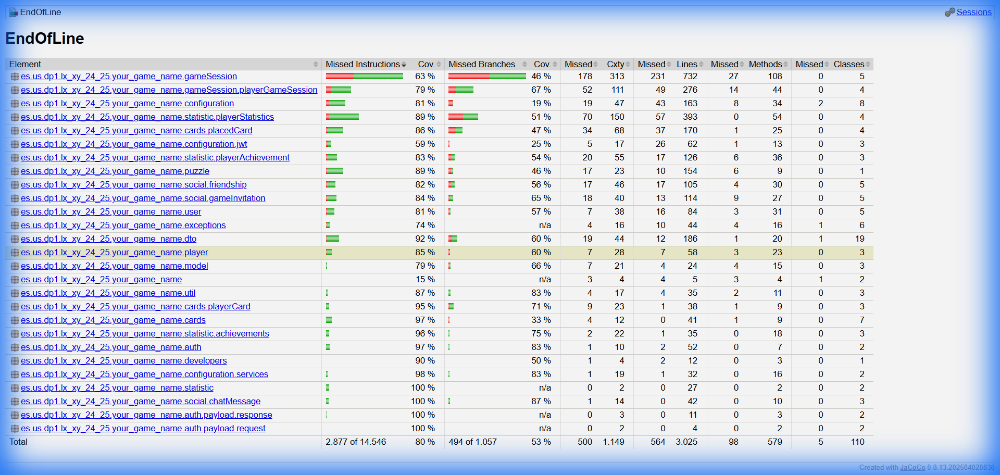
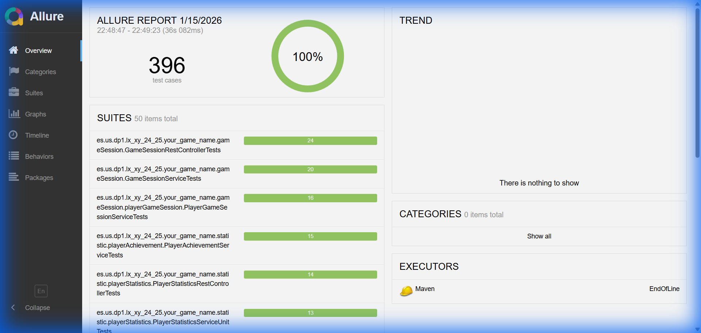

# Plan de Pruebas

**Asignatura:** Diseño y Pruebas (Grado en Ingeniería del Software, Universidad de Sevilla)  
**Curso académico:** 2025/2026
**Grupo/Equipo:** L5-3 
**Nombre del proyecto:** End Of Line
**Repositorio:** [https://github.com/gii-is-DP1/dp1-2025-2026-l5-3-25.git] (http://github.com)
**Integrantes (máx. 6):** 
- **Álvaro de Pablos Sánchez** (wbk2747 / alvpapbsan@alum.us.es)  
- **Carmen Camacho Montes** (JBV8381 / carcammon@alum.us.es)  
- **Francisco Casasola Calzadilla** (QHR9543 / fracascal@alum.us.es)  
- **Alejandro Pichardo Martínez** (alepicmar / alepicmar@alum.us.es)  
- **Juan Pozo Gracia** (DKK2084 / juapozgar@alum.us.es)  
- **Nicolás Pérez Martín** (YGC9995 / nicpermar@alum.us.es)  

## 1. Introducción

Este documento describe el plan de pruebas para el proyecto **EndOfLine** desarrollado en el marco de la asignatura **Diseño y Pruebas 1** por el grupo **L5-3**. El objetivo del plan de pruebas es garantizar que el software desarrollado cumple con los requisitos especificados en las historias de usuario y que se han realizado las pruebas necesarias para validar su funcionamiento.

## 2. Alcance

El alcance de este plan de pruebas incluye las siguientes categorías de pruebas automatizadas para el proyecto **End Of Line**:

### 2.1 Pruebas de Backend (Java/Spring Boot)
- **Pruebas Unitarias**: Servicios, repositorios, utilidades, DTOs y lógica de negocio aislada
- **Pruebas de Integración**: Controladores REST, endpoints de API, integración con base de datos H2
- **Pruebas Parametrizadas**: Validación con múltiples conjuntos de datos y casos edge
- **Pruebas de Configuración**: Seguridad (JWT), WebSockets, componentes transversales

### 2.2 Pruebas de Frontend (JavaScript/React)
- Componentes React (pendiente de mayor implementación)
- Hooks personalizados
- Utilidades y funciones JavaScript

### 2.3 Exclusiones
- Pruebas end-to-end (E2E) de interfaz completa
- Pruebas de carga y rendimiento
- Pruebas manuales de interfaz de usuario

## 3. Estrategia de Pruebas

### 3.1 Tipos de Pruebas

#### 3.1.1 Pruebas Unitarias de Backend

Las pruebas unitarias de backend verifican el correcto funcionamiento de componentes individuales del sistema, aislándolos de sus dependencias mediante mocking.

**Alcance:**
- **Servicios de negocio**: Lógica de juego, gestión de estadísticas, sistema de logros, chat, amistades, invitaciones
- **Repositorios**: Validación de consultas personalizadas y operaciones de persistencia
- **Utilidades y helpers**: Funciones auxiliares, conversores, validadores
- **DTOs y mapeos**: Transformaciones de datos entre capas

**Ejemplos implementados:**
- `PlayerCardServiceTests`: Pruebas del servicio de gestión de cartas del jugador
- `GameSessionServiceTests`: Lógica de creación, inicio y finalización de partidas
- `PlayerStatisticsServiceTests`: Cálculo y actualización de estadísticas de jugadores
- `PlayerAchievementServiceTests`: Sistema de desbloqueo de logros

**Herramientas:** JUnit 5, Mockito, Spring Boot Test

#### 3.1.2 Pruebas de Integración de API

Las pruebas de integración evalúan la interacción entre múltiples componentes del sistema, especialmente a nivel de controladores REST y la integración con la base de datos.

**Alcance:**
- **Controladores REST**: Validación de endpoints, manejo de peticiones HTTP, serialización/deserialización JSON
- **Seguridad y autenticación**: Verificación de JWT, control de acceso basado en roles
- **Validaciones**: Comprobación de reglas de negocio a nivel de API
- **Transaccionalidad**: Rollback automático en entornos de prueba

**Ejemplos implementados:**
- `GameSessionRestControllerTests`: Endpoints de gestión de sesiones de juego
- `PlacedCardControllerTests`: API para colocar cartas en el tablero
- `FriendshipControllerTests`: Gestión de solicitudes de amistad
- `GameInvitationControllerTests`: Sistema de invitaciones a partidas
- `ChatMessageControllerTests`: Endpoints de chat en tiempo real

**Herramientas:** MockMvc, Spring Security Test, @WebMvcTest, @SpringBootTest

#### 3.1.3 Pruebas Parametrizadas

Pruebas que ejecutan el mismo escenario con diferentes conjuntos de datos de entrada para validar comportamientos bajo múltiples condiciones.

**Alcance:**
- Validación de reglas de juego con diferentes configuraciones
- Pruebas de límites y casos extremos
- Verificación de comportamiento con diferentes tipos de usuario

**Ejemplos implementados:**
- `GameSessionServiceParameterizedTests`: Validación de lógica con diferentes modos de juego
- Tests de validación con múltiples combinaciones de entrada

**Herramientas:** JUnit 5 @ParameterizedTest, @ValueSource, @MethodSource

#### 3.1.4 Pruebas de Configuración y Componentes Técnicos

Pruebas que verifican la correcta configuración de componentes transversales del sistema.

**Alcance:**
- **Seguridad**: Configuración de filtros JWT, autorización, CORS
- **WebSockets**: Eventos de conexión/desconexión, interceptores
- **Conversores y configuración**: Bean validation, conversores personalizados

**Ejemplos implementados:**
- `JwtUtilsTests`: Generación y validación de tokens JWT
- `WebSocketEventListenerTests`: Eventos del sistema de mensajería en tiempo real

**Herramientas:** Spring Test, JUnit 5

#### 3.1.5 Pruebas de Frontend (Jest + React Testing Library)

**Nota:** Aunque la infraestructura está configurada, las pruebas de frontend están pendientes de implementación más completa.

**Alcance previsto:**
- Componentes React individuales
- Hooks personalizados
- Utilidades y helpers de JavaScript
- Integración de componentes

**Herramientas:** Jest, React Testing Library

## 4. Herramientas y Entorno de Pruebas

### 4.1 Herramientas
- **Maven**: Gestión de dependencias y ejecución de las pruebas.
- **JUnit**: Framework de pruebas unitarias.
- **Jacoco**: Generación de informes de cobertura de código. Si se ejecuta el comando de maven install, se copiará el informe de cobertura a la subcarpeta del repositorio /docs/deliverables/D3/coverage (puede visualizarse pulsando en el fichero index.html de dicho directorio).
- **Allure**: Generación de informes de estado de las últimas ejecuciones de las pruebas. Permite agrupar las pruebas por módulo/épica y feature. Si se ejecuta el comando de maven install, se copiará el informe de estado a la subcarpeta del repositorio /docs/deliverables/D3/status (puede visualizarse pulsando en el fichero index.html de dicho directorio).
- **Jest**: Framework para pruebas unitarias en javascript.
- **React-test**: Librería para la creación de pruebas unitarias de componentes React.

### 4.2 Entorno de Pruebas
Las pruebas se ejecutarán en el entorno de desarrollo y, eventualmente, en el entorno de pruebas del servidor de integración continua.

## 5. Planificación de Pruebas
### 5.1 Estado y trazadibilidad de Pruebas por Módulo y Épica

El informe de estado de las pruebas (con trazabilidad de éstas hacia los módulos y las épicas/historias de usaurio) se encuentra [aquí](https://gii-is-dp1.github.io/dp1-2025-2026-l5-3-25/deliverables/D3/status/).

### 5.2 Cobertura de Pruebas

El informe de cobertura de pruebas se puede consultar [aquí](https://gii-is-dp1.github.io/dp1-2025-2026-l5-3-25/deliverables/D3/coverage/).

### 5.3 Capturas de Pantalla de los Reportes

**Evidencia de Cobertura al 80%:**

*Reporte JaCoCo mostrando 80% de cobertura de instrucciones (11,669 de 14,546 instrucciones cubiertas)*

**Evidencia de Tests Ejecutados:**

*Reporte Allure mostrando 396 tests ejecutados con 100% de éxito*

*Nota importante*: Los informes se publican automáticamente mediante GitHub Pages. Asegúrate de ejecutar `./mvnw clean install` antes de hacer commit para actualizar los reportes en la carpeta `docs/deliverables/D3`. Las capturas de pantalla se incluyen como evidencia alternativa hasta que GitHub Pages esté habilitado por el administrador del repositorio.

## 6. Criterios de Aceptación

### 6.1 Criterios de Cobertura
- ✅ **Cobertura de instrucciones**: Mínimo 70% - **Logrado: 80%** (11,669 de 14,546 instrucciones)
- ✅ **Cobertura de líneas**: Mínimo 70% - **Logrado: 84%** (2,469 de 3,025 líneas)
- Cobertura de ramas: Objetivo 50% - **Logrado: 53%** (570 de 1,057 ramas)

### 6.2 Criterios de Calidad de Tests
- ✅ **Todas las pruebas pasan exitosamente** - **396 tests con 100% de éxito**
- Los tests deben ser deterministas y repetibles
- No debe haber tests deshabilitados (@Disabled) sin justificación documentada
- Los tests deben ejecutarse en menos de 5 minutos en total

### 6.3 Criterios de Organización
- Tests organizados por módulos y épicas usando anotaciones de Allure (@Feature, @Epic)
- Uso de convenciones de nombrado: `should[Acción][Condición]`
- Tests documentados con descripciones claras de lo que verifican

### 6.4 Criterios de No Regresión
- No debe haber fallos críticos en las pruebas de integración
- Los errores de seguridad y autenticación deben estar cubiertos por tests
- Las reglas de negocio principales deben tener cobertura del 100%

## 7. Conclusión

Este plan de pruebas establece la estructura y los criterios para asegurar la calidad del software desarrollado para el proyecto **End Of Line**. 

**Estado actual del proyecto:**
- ✅ Cobertura de código: **80%** (superando el objetivo del 70%)
- ✅ Total de pruebas: **396 tests** ejecutados exitosamente
- ✅ Tasa de éxito: **100%**
- ✅ Trazabilidad: Tests organizados por épicas y features mediante Allure

El equipo ha alcanzado y superado los objetivos de cobertura establecidos, garantizando así un nivel de calidad robusto para la entrega del proyecto. Es responsabilidad del equipo mantener este estándar de calidad en futuras iteraciones y continuar expandiendo la cobertura de pruebas, especialmente en el frontend.
